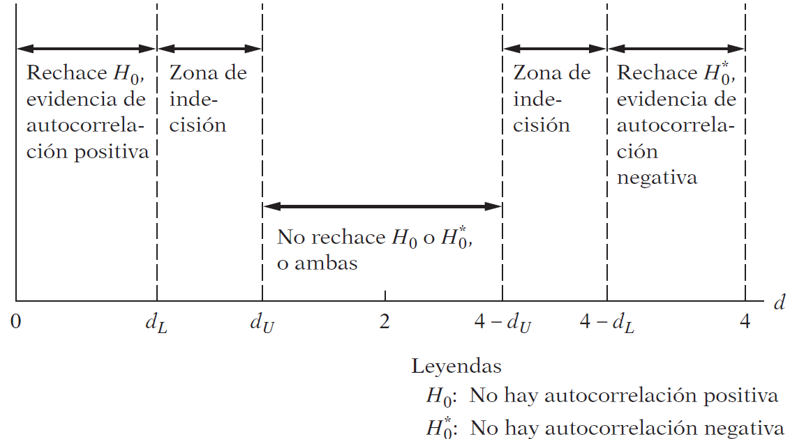

```{r setup, include = F}
# This is the recommended set up for flipbooks
# you might think about setting cache to TRUE as you gain practice --- building flipbooks from scratch can be time consuming
options(width = 70)
knitr::opts_chunk$set(
  dev.args = list(bg = 'transparent'),
  fig.width = 12, message = TRUE,
  warning = FALSE, comment = "", cache = TRUE, fig.retina = 3
)
knitr::opts_knit$set(global.par = TRUE)
Sys.setenv(`_R_S3_METHOD_REGISTRATION_NOTE_OVERWRITES_` = "false")
# remotes::install_github("luukvdmeer/sfnetworks")
# remotes::install_github("EvaMaeRey/flipbookr")
# remotes::install_github("rlesur/klippy")
# devtools::install_github("gadenbuie/xaringanExtra")
library(flipbookr)
library(xaringanthemer)
library(tidyverse)
library(klippy)
library(xaringanExtra)
```

<style>
.notbold{
    font-weight:normal
}

body {
text-align: justify;
}

h1{
      margin-top: -1px;
      margin-bottom: -3px;
}

.small-code pre{
  margin-bottom: -10px;
  
}  

.medium-code pre{
  margin-bottom: 2px;
  
} 
</style>

```{r xaringan-scribble, echo=FALSE}
#xaringanExtra::use_scribble()
```

```{r xaringanExtra-clipboard, echo=FALSE}
htmltools::tagList(
  xaringanExtra::use_clipboard(
    button_text = "<i class=\"fa fa-clipboard\"></i>",
    success_text = "<i class=\"fa fa-check\" style=\"color: #90BE6D\"></i>",
    error_text = "<i class=\"fa fa-times-circle\" style=\"color: #F94144\"></i>"
  ),
  rmarkdown::html_dependency_font_awesome()
)
```

```{r xaringan-extra-styles, echo=FALSE}
xaringanExtra::use_extra_styles(
  hover_code_line = TRUE,         #<<
  mute_unhighlighted_code = TRUE  #<<
)
```
<font size = "5">

<br>
<br>
<br>
<br>
<br>

Link slides en formato [html](https://gusgarciacruz.github.io/EconometriaII/autocorrelacion/autocorrelacion.html)

Link slides en formato [PDF](https://gusgarciacruz.github.io/EconometriaII/autocorrelacion/autocorrelacion.pdf)
---
# <span style="font-size:80%">En este tema</span>

- <span style="font-size:150%">[<span style="color:black">Naturaleza del problema](#naturaleza)</span> <br> <br>

- <span style="font-size:150%"> [<span style="color:black">Consecuencias de utilizar MCO en presencia de autocorrelación](#consecuencias)</span> <br> <br>

- <span style="font-size:150%"> [<span style="color:black">Estructuras de la autocorrelación](#estructuras)</span> <br> <br>

- <span style="font-size:150%"> [<span style="color:black">Detección de la autocorrelación](#deteccion)</span> <br> <br>

- <span style="font-size:150%"> [<span style="color:black">Solución a la autocorrelación: el estimador MCG](#solucion)</span> <br> <br>

- <span style="font-size:150%"> [<span style="color:black">Ejercicio aplicado en R: relación entre salarios y productividad](#r)</span>

---
# <span style="font-size:80%">Lecturas</span>
- <span style="font-size:150%">Wooldridge, J. (2013). *Introducción a la econometría*. 5a edición, Cengage Learning. <span style="color:blue">Caps 10, 11 y 12 <br> <br>

- <span style="font-size:150%"> Gujarati, D. y Porter, D. (2010). *Econometría*. 5a edición, Mc Graw Hill. <span style="color:blue">Cap 12 <br> <br>

---
name: naturaleza
# <span style="font-size:80%">Naturaleza del problema</span>

- En estudios con datos de corte transversal es más común la presencia de heteroscedasticidad 

- Ya que los datos de corte transversal se recopilan con base en una muestra aleatoria de unidades transversales (familias o empresas) no existe razón previa para pensar que el término de error correspondiente a una familia o empresa esté correlacionado con el término de error de otra familia o empresa $\Longrightarrow$ a menos de que exista <font color = "blue">autocorrelación espacial</font>, es decir una autocorrelación en el espacio más que en el tiempo

- Cuando se trabajan con datos de series de tiempo, estos datos siguen un ordenamiento natural respecto del tiempo, <font color = "blue">de modo que es muy posible que las observaciones sucesivas muestren intercorrelaciones, sobre todo si el intervalo ente observaciones sucesivas es muy corto, como un día, una semana o un mes: por ejemplo, los índices bursátiles como el Dow Jones o el S&P500</font>

- En esta situación de alta interrelación temporal entre los datos es más probable que se <font color = "blue">viole el supuesto de no autocorrelación</font>

---
# <span style="font-size:80%">Naturaleza del problema</span>

- <font color = "blue">Autocorrelación</font>: correlación entre miembros de series de observaciones ordenadas en el tiempo (datos de series de tiempo) o en el espacio (datos de corte transversal)

- En el contexto de regresión, el modelo clásico de regresión lineal supone que:

$$Cov(u_{i},u_{j} | x_{i},x_{j})=E(u_{i}u_{j})=0 \text{ con } i\neq j$$
- Pero en el contexto de series de tiempo principalmente es un supuesto que pueda no se mantenga lo que implica que $E(u_{i}u_{j})\neq 0$

---
# <span style="font-size:80%">Naturaleza del problema</span>

Visualicemos algunos patrones de autocorrelación y de no autocorrelación

```{r, echo=FALSE, out.width="38%",fig.align='center'}
knitr::include_graphics("f1.png")
```

---
# <span style="font-size:80%">Naturaleza del problema</span>

¿Por qué ocurre la correlación serial?
- <font color = "blue">Inercia</font> <br>
Las series de tiempo económicas se caracterizan por tener inercia o pasividad $\Longrightarrow$ las observaciones sucesivas sean interdependientes


- <font color = "blue">Sesgo de especificación</font> <br>
<p style="margin-bottom: -1em">
	- Variables excluidas
	- Forma funcional incorrecta

- <font color = "blue">"Manipulación" o transformación de datos</font>
<p style="margin-bottom: -1em">	
	- Pasar de datos que son mensuales a trimestrales
	- Interpolación o extrapolación de datos

- <font color = "blue">No estacionariedad</font> <br>
Una serie de tiempo es <font color = "blue">estacionaria</font> si sus características (media, varianza y covarianza) son invariantes respecto al tiempo. Si no es así, tenemos una serie de tiempo <font color = "blue">no estacionaria</font>. Si en un modelo de regresión $Y$ y las $X$s son no estacionarias, el término de error será no estacionario y por tanto mostrará autocorrelación 

---
name: consecuencias
# <span style="font-size:80%">Consecuencias de utilizar MCO en presencia de autocorrelación</span>

<font color = "blue">¿Qué sucede con los estimadores MCO y sus varianzas si introducimos autocorrelación en las perturbaciones?</font>

Partamos del siguiente modelo de RLS

$$Y_{t} = \beta_{1} + \beta_{2}X_{t} + u_{t}$$
Ahora debemos suponer el mecanismo que generan las $u_{t}$. Como punto de partida vamos a suponer sigue el siguiente proceso:

$$u_{t}=\rho u_{t-1}+\epsilon_{t}$$
donde $\rho$ se conoce como <font color = "blue">coeficiente de autocovarianza</font> o <font color = "blue">coeficiente de autocorrelación de primer orden</font> y este esquema que sigue $u_{t}$ se conoce como <font color = "blue">esquema autorregresivo de primer orden</font> y suele denotarse como <font color = "blue">AR(1)</font>

$\epsilon_{t}$ es una perturbación aleatoria que satisface los supuestos estándar:

$$E(\epsilon_{t})=0, \   \ Var(\epsilon_{t})=\sigma_{\epsilon}^{2}, \    \ Cov(\epsilon_{t},\epsilon_{t+s}) = 0 \   \ \text{ con } s\neq 0$$
Con estas propiedades, $\epsilon_{t}$ es lo que en la literatura le llaman un <font color = "blue">término de error de ruido blanco</font>

---
name: consecuencias
# <span style="font-size:80%">Consecuencias de utilizar MCO en presencia de autocorrelación</span>
<font size = "3">
Es posible demostrar que con el esquema AR(1)

$$Var(u_{t}) = \frac{\sigma_{\epsilon}^{2}}{1-\rho^2}$$
$$Cov(u_{t},u_{t+s})=E(u_{t}u_{t+s})=\rho^{s}\frac{\sigma_{\epsilon}^{2}}{1-\rho^2}$$
$$Cor(u_{t},u_{t+s})=\rho^{s}$$

La matriz de varianzas-covarianzas de $u_{t}$ tiene la forma

$$Cov(\textbf{u}) = \frac{\sigma_{\epsilon}^2}{1-\rho^2} \left[ \begin{array}{ccccc}
1                 & \rho             & \rho^2           & \ldots & \rho^{T-1}  \\
\rho              & 1                & \rho             & \ldots & \rho^{T-2}  \\
\rho^2            & \rho             & 1                & \ldots & \rho^{T-3}  \\
\vdots            & \vdots           & \vdots           & \vdots & \vdots\\
\rho^{T-1}        & \rho^{T-2}       & \rho^{T-3}       & \ldots & 1  \\ 
\end{array} \right] = \sigma_{u}^2\boldsymbol\Omega \neq \sigma_{u}^2 \textbf{I}_{n}$$

<p style="margin-bottom: -1em">	
Note que bajo el esquema AR(1), $u_{t}$ es:
- homocedástica
- autocorrelacionada

También note que resulta crítico que $|\rho|<1$. Si por ejemplo $\rho=1$ (raiz unitaria), las varianzas y covarianzas no están definidas. Si $|\rho|<1$, se dice que el proceso AR(1) es estacionario, es decir la media, la varianza y la covarianza de $u_{t}$ no cambian respecto al tiempo

---
# <span style="font-size:80%">Consecuencias de utilizar MCO en presencia de autocorrelación</span>

Volviendo al modelo de RLS, sabemos que el estimador MCO de la matriz var-cov de $\widehat{\textbf{B}}$ es:

$$Cov(\widehat{\textbf{B}}) = \sigma_{u}^2 (\textbf{X}'\textbf{X})^{-1}$$

Ahora, con el esquema AR(1) la matriz var-cov de $\widehat{\textbf{B}}$ será:
<p style="margin-bottom: 2em">
$$Cov(\widehat{\textbf{B}}) =\sigma_{u}^2(\textbf{X}'\textbf{X})^{-1}\textbf{X}'\Omega\textbf{X}(\textbf{X}'\textbf{X})^{-1}$$

<p style="margin-bottom: -1em">
En conclusión, si se aplica MCO a un modelo con autocorrelación:
- Los MCO continuan siendo insesgados y lineales
- Las varianzas y errores estándar de los estimadores son erróneos
- Los MCO no alcanzan la mínima varianza
- Se invalida la inferencia estadística: intervalos de confianza (más amplios) y pruebas de hipótesis (se tiende a no rechazar $H_0$)

---
name: estructuras
# <span style="font-size:80%">Estructuras de la autocorrelación</span>

<font color = "blue">1. Proceso Autorregresivo lineal de primer orden  AR(1)</font>

El proceso generador de datos AR(1) supone que:

$$u_t = \rho u_{t-1} + \epsilon_t$$
Con $\epsilon_t$ siendo ruido blanco 

$$E(\epsilon_t)=0$$
$$Var(\epsilon_t)=\sigma_{\epsilon}^2$$
$$Cov(\epsilon_t,\epsilon_s)=E(\epsilon_t\epsilon_s)=0 \   \ \forall t\neq s$$
$$Cov(\epsilon_t,u_{t-s})=E(\epsilon_{t}u_{t-s})=0 \   \ \forall t\neq s$$

La matriz de var-cov para $u$ puede representarse como:

$$Cov(\textbf{u}) = \frac{\sigma_{\epsilon}^2}{1-\rho^2} \left[ \begin{array}{ccccc}
1                 & \rho             & \rho^2           & \ldots & \rho^{T-1}  \\
\rho              & 1                & \rho             & \ldots & \rho^{T-2}  \\
\rho^2            & \rho             & 1                & \ldots & \rho^{T-3}  \\
\vdots            & \vdots           & \vdots           & \vdots & \vdots\\
\rho^{T-1}        & \rho^{T-2}       & \rho^{T-3}       & \ldots & 1  \\ \end{array} \right] = \sigma_{u}^2\boldsymbol\Omega \neq \sigma_{u}^2 \textbf{I}_{n}$$

El análisis puede extenderse a procesos autorregresivos de orden p, AR(p) 

---
# <span style="font-size:80%">Estructuras de la autocorrelación</span>

<font color = "blue">1. Proceso Autorregresivo lineal de primer orden  AR(1)</font>

En este mundo se ha desarrollado una notación eficiente para los rezagos con el operador $L$. Por ejemplo, el AR(1) se escribe como:

$$
\begin{aligned}
u_t & = \rho u_{t-1} + \epsilon_t\\
    & = \rho L u_t + \epsilon_t\\
u_t - \rho L u_t & = \epsilon_t\\
u_t & = \frac{\epsilon_t}{1 - \rho L}
\end{aligned}
$$
Así para un proceso AR(p) sería

$$
\begin{aligned}
u_t & = \rho_1 u_{t-1} + \rho_2 u_{t-2} + ... + \rho_p u_{t-p} + \epsilon_t\\
u_t & = \rho_1 Lu_{t} + \rho_2 L^2 u_{t} + ... + \rho_p L^p u_{t} + \epsilon_t\\
u_t (1 - \rho_1 L + \rho_2 L^2 + ... + \rho_p L^p) & = \epsilon_t\\
\end{aligned}
$$
Se define el operador polinomio de rezagos como

$$\rho(L) = 1 - \rho_1 L + \rho_2 L^2 + ... + \rho_p L^p$$
El proceso AR(p) se expresa como

$$\rho(L)u_t = \epsilon_t$$

---
# <span style="font-size:80%">Estructuras de la autocorrelación</span>

<font color = "blue">2. Proceso de Medias Moviles MA(1) de primer orden</font>

Formalmente el proceso se expresa como:

$$u_t = \theta \epsilon_{t-1} + \epsilon_t$$

Con $\epsilon_t$ siendo ruido blanco y $|\theta|<1$ condición de invertibilidad del proceso

La matriz de var-cov para $u$ puede representarse como:

$$Cov(\textbf{u}) = \sigma_{\epsilon}^2 (1+\theta^2) \left[ \begin{array}{cccc}
1                 & \theta           & \ldots & 0  \\
\theta            & 1                & \ldots & 0   \\
\vdots            & \vdots           & \vdots & \vdots\\
0                 & 0                & \ldots & 1  \\ \end{array} \right] = \sigma_{u}^2 \boldsymbol\Omega \neq \sigma_{u}^2 \textbf{I}_{n}$$


El análisis puede extenderse a procesos de medias móviles de orden q, MA(q). 

En términos del operador de rezagos, el proceso MA(q) se expresa como 

$$
\begin{aligned}
u_t & = \epsilon_t + \theta_1 \epsilon_{t-1} + \theta_2 \epsilon_{t-2} + ... + \theta_q \epsilon_{t-q} \\
u_t & = \epsilon_t + \theta_1 L\epsilon_{t} + \theta_2 L^2 \epsilon_{t} + ... + \theta_q L^q \epsilon_{t} + \epsilon_t\\
u_t & = (1 - \theta_1 L + \theta_2 L^2 + ... + \theta_q L^q) \epsilon_t\\
u_t & = \theta(L)\epsilon_t
\end{aligned}
$$
 
---
# <span style="font-size:80%">Estructuras de la autocorrelación</span>
<font color = "blue">3. Proceso ARMA(p,q)</font>

Combina las generalizaciones de los dos anteriores procesos

$$u_t = \rho_{1} u_{t-1} + ... + \rho_{p} u_{t-p} + \epsilon_t + \theta_{1} \epsilon_{t-1} + ... + \theta_{q} \epsilon_{t-q}$$
$$\rho(L)u_t = \theta(L)\epsilon_t$$
---
name: deteccion
# <span style="font-size:80%">Detección de la autocorrelación</span>

<font color = "blue">1. Método gráfico</font>

- Recuerde que el supuesto de no autocorrelación del modelo clásico se relaciona con las perturbaciones poblacionales $u_t$, las cuales no pueden observarse directamente. En su lugar disponemos de valores sustitutos, los residuos $\widehat{u}_{t}$, a partir del procedimiento usual MCO

- Un examen visual de las $\widehat{u}$ da algunas claves sobre la posible presencia de autocorrelación en las $u$

- En realidad, un examen visual de $\widehat{u}_t$ o $(\widehat{u}_{t}^2)$ proporciona información útil no sólo sobre la autocorrelación, sino también sobre heteroscedasticidad, sobre el grado de adecuación del modelo o sobre el sesgo de especificación

- Hay diversas formas de examinar los residuales:
  - $\widehat{u}_t$ contra el tiempo
	- los residuos estandarizados $(\widehat{u}_t/\widehat{\sigma}_{u})$ respecto del tiempo

---
# <span style="font-size:80%">Detección de la autocorrelación</span>

```{r, out.width="46%",fig.align='center'}
library(gujarati); library(tidyverse) # install.packages("remotes"), remotes::install_github("brunoruas2/gujarati")

data("Table12_4") 
data <- Table12_4 |> mutate(year = as.numeric(as.character(Year)),
                            y = as.numeric(as.character(Y)), x = as.numeric(as.character(X))) |> 
  select(year, y, x)

modelo <- lm(log(y) ~ log(x), data = data)
data <- data |> mutate(u = resid(modelo), u_e = u/sd(u))

ggplot(data) +
  geom_line(aes(x=year, y=u), color = "blue") +
  geom_line(aes(x=year, y=u_e/46), color = "red") + # 46 = max(data$u_e)/max(data$u)
  geom_hline(yintercept = 0) +
  scale_y_continuous(name = "u", sec.axis = sec_axis(~.*46, name = "u_e"))
```

Observamos que tanto $\widehat{u}_t$ como $\widehat{u}_t$ estandarizados presentan un patrón, lo que indica que tal vez las $\widehat{u}_t$ no sean aleatorias

---
# <span style="font-size:80%">Detección de la autocorrelación</span>
Para ver esto en forma diferente, podemos graficar $\widehat{u}_t$ respecto de $\widehat{u}_{t-1}$, es decir, el residuo en el tiempo $t$ frente a su valor en el tiempo $(t-1)$, una clase de prueba empírica del esquema AR(1)

```{r, out.width="50%",fig.align='center'}
data <- data |> mutate(u_lag1 = lag(u, lag=1))

ggplot(data, aes(x=u_lag1, y=u)) +
  geom_point(color = "blue", size = 3) +
  geom_hline(yintercept = 0) + geom_vline(xintercept = 0) +
  geom_smooth(method = "lm", se = FALSE, formula= y~x, color="red")
```

Como muestra esta figura, la mayoría de los residuos están agrupados en el segundo y el cuarto cuadrantes, lo cual indica una <font color = "blue">correlación positiva fuerte en los residuos</font>

---
# <span style="font-size:80%">Detección de la autocorrelación</span>

<font color = "blue">2. Prueba $d$ de Durbin-Watson</font>

- La prueba más conocida para detectar correlación serial es la de los estadísticos Durbin y Watson

- Se le conoce como <font color = "blue">estadístico $d$ de Durbin-Watson</font>, que se define como:

$$d = \frac{\sum\limits_{t=2}^{T} (\widehat{u}_{t}-\widehat{u}_{t-1})^2}{\sum\limits_{t=1}^{T} \widehat{u}_{t}^2}$$

- Aunque el estadístico $d$ se utiliza ahora en forma rutinaria, <font color = "blue">es importante observar los supuestos en los cuales se basa</font>:
<p style="margin-bottom: -1em">	
	- El modelo de regresión incluye el término del intercepto
	- Las perturbaciones $u_t$ se generan mediante el esquema autorregresivo de primer orden: $u_t = \rho u_{t - 1} + \epsilon_t$. Por tanto, no se pueden utilizar para detectar esquemas autorregresivos de orden superior
	- Se supone que el término de error $u_t$ está normalmente distribuido $\Longrightarrow$ $d\longrightarrow 2$
	- El modelo de regresión no incluye valor(es) rezagado(s) de la variable dependiente como una variable explicativa
	- No hay observaciones faltantes en los datos

---
# <span style="font-size:80%">Detección de la autocorrelación</span>

- El muestreo exacto o la distribución de probabilidad del estadístico $d$ es difícil de derivar porque, como demostraron Durbin y Watson, tiene una dependencia compleja de los valores presentes de $X$ en una muestra dada

- Por consiguiente, a diferencia de las pruebas $t$, $F$ o $\chi^2$, no hay un valor crítico único que lleve al rechazo o al no rechazo de la hipótesis nula de que no hay correlación serial de primer orden en las perturbaciones $u_t$

- Sin embargo, Durbin y Watson lograron encontrar un límite inferior $d_L$ y un límite superior $d_U$ tales que si el valor $d$ calculado cae por fuera de estos valores críticos, puede tomarse una decisión respecto de la presencia de correlación serial positiva o negativa

- Además, estos límites sólo dependen del número de observaciones $n$ y del número de variables explicativas, y no de los valores que adquieren estas variables explicativas

- Para determinar la presencia o ausencia de autocorrelación del tipo AR(1) se siguen las siguientes reglas:

	- Ausencia de autocorrelación: $d=2$
	- Autocorrelación positiva: $0\leq d\leq 2$
	- Autocorrelación negativa: $2 < d \leq 4$

---
# <span style="font-size:80%">Detección de la autocorrelación</span>

Como se mencionó, $d$ no tiene una distribución exacta y, por tanto, se trabaja con umbrales críticos. La distribución se tabula por $d_L$ y $d_U$:

- $0\leq d < d_L$: <font color = "blue">autocorrelación lineal positiva</font>
- $d_L\leq d < d_U$: <font color = "blue">resultado incierto - test no concluyente</font>
- $d_U\leq d < 4-d_U$: <font color = "blue">no hay autocorrelación</font>
- $4-d_U\leq d < 4-d_L$: <font color = "blue">resultado incierto - test no concluyente</font>
- $4-d_L\leq d < 4$: <font color = "blue">autocorrelación lineal negativa</font>

Gráficamente:

```{r, echo=FALSE, out.width="55%",fig.align='center'}

```

---
# <span style="font-size:80%">Detección de la autocorrelación</span>
	
<font color = "blue">3. Test basados en el correlograma</font>
<p style="margin-bottom: -1em">
<font size = "3">
	
El correlograma de una serie temporal se basa en dos funciones:
<p style="margin-bottom: -1em">
- la función de autocorrelación simple (*Autocorrelation - AC*)
- la función de autocorrelación parcial (*Partial autocorrelation - PAC*)

<font color = "blue">Autocorrelation - AC</font><br>
Se construye con base en las correlaciones simples de la serie con sus rezagos

$\widehat{\rho}_1$: primer coeficiente de autocorrelación, es la correlación simple de la serie en $t$ y en $t-1$

$$\rho_1 = Cov(u_t , u_{t-1}) = \frac{Cov(u_t , u_{t-1})}{\sigma_{u_{t}}\sigma_{u_{t-1}}} = \frac{Cov(u_t , u_{t-1})}{Var(u_t)}$$

<p style="margin-bottom: -1em">
Empíricamente
$$\widehat{\rho}_1 = \frac{\sum\limits_{t=2}^{T} \widehat{u}_t \widehat{u}_{t-1}}{\sum\limits_{t=2}^{T} \widehat{u}_{t}^2}$$
<p style="margin-bottom: -1em">
Y así en general el $\rho_s = \frac{Cov(u_t , u_{t-s})}{Var(u_t)}$ y en términos empíricos:

$$\widehat{\rho}_s = \frac{\sum\limits_{t=2}^{T} \widehat{u}_t \widehat{u}_{t-s}}{\sum\limits_{t=2}^{T} \widehat{u}_{t}^2}$$

---
# <span style="font-size:80%">Detección de la autocorrelación</span>

<font color = "blue">Partial autocorrelation - PAC</font><br>
Se construye con base en los coeficientes de correlación parcial entre las series y sus rezagos. La forma más sencilla de calcularlos son a partir de las ecuaciones de Yule y Walker

Se estiman las siguientes regresiones:

$$\widehat{u}_t = \widehat{\phi}_{11}\widehat{u}_{t-1} + residuo$$
$\widehat{\phi}_{11}$: primer coeficiente de autocorrelación parcial (coincide con $\widehat{\rho}_1$)

$$\widehat{u}_t = \widehat{\phi}_{12}\widehat{u}_{t-1} + \widehat{\phi}_{22}\widehat{u}_{t-2} + residuo$$
$\widehat{\phi}_{22}$: segundo coeficiente de autocorrelación parcial

En general, $\widehat{\phi}_{ss}$ en la regresión de $\widehat{u}_{t} = f(\widehat{u}_{t-1},\widehat{u}_{t-2},...,\widehat{u}_{t-s})$ es el enésimo coeficiente de correlación parcial
<p style="margin-bottom: -1em">
Para construir el correlograma se requiere las respectivas varianzas:

$$Var(\widehat{\rho}_s) \cong \frac{1}{T}(1+2(\widehat{\rho}_{1}^2 + \widehat{\rho}_{2}^2 +...+\widehat{\rho}_{s-1}^2))$$
$$Var(\widehat{\phi}_{ss}) \cong \frac{1}{T}$$

En general, $\frac{\widehat{\rho}_s}{\sqrt{Var(\widehat{\rho}_s)}}$ y $\frac{\widehat{\phi}_{ss}}{\sqrt{Var(\widehat{\phi}_{ss})}}$ $\longrightarrow$ $N(0,1)$

---
# <span style="font-size:80%">Detección de la autocorrelación</span>

La AC y PAC no solo se usan para diagnosticar autocorrelación, sino también para identificar el proceso generador de datos de la serie

Si el proceso fuese un AR(1): $u_t = \phi u_{t-1} + \epsilon_t$

|AC    |||  PAC|
|:----:|||:-----:|
| $\widehat{\rho}_1 =\frac{\phi \sigma_{u}^2}{\sigma_{u}^2}=\phi$ ||| $\phi_{11} = \phi$|
| $\widehat{\rho}_2 = \phi^2$                                     ||| $\phi_{12} = 0$|
| $\vdots$                                                        ||| $\vdots$|
| $\widehat{\rho}_s = \phi^s$                                     ||| $\phi_{1s} = 0$|  

Mientras la AC disminuye lentamente, la PAC se corta abruptamente

---
# <span style="font-size:80%">Detección de la autocorrelación</span>

Simulamos un proceso AR(1)
```{r}
ar1 <- arima.sim(list(ar=.8), n=500)
```


.small-code[
.pull-left-50[
```{r, out.width="100%",fig.align='center'}
acf(ar1, 26, xlim=c(1,26), ylim=c(-.1,.9), main = "", ylab = "", xlab = "", xaxt="none", cex=1.5)
axis(1, 1:26)
mtext(side=1, line=3, "Lag",cex=1.5)
mtext(side=2, line=3, "Autocorrelation (AC)",cex=1.5)
```
]

.pull-right-50[
```{r, out.width="100%",fig.align='center'}
pacf(ar1, 26, ylim=c(-.1,.9), main = "", ylab = "", xlab = "", xaxt="none")
axis(1, 1:26)
mtext(side=1, line=3, "Lag",cex=1.5)
mtext(side=2, line=3, "Partial autocorrelation (PAC)",cex=1.5)
```
]
]

---
# <span style="font-size:80%">Detección de la autocorrelación</span>

Con un proceso MA(1) sucede todo lo contrario: $u_t = \theta\epsilon_{t-1} + \epsilon_{t}$

Simulamos un proceso MA(1)
```{r}
ma1 <- arima.sim(list(ma=.7), n=500)
```

<p style="margin-bottom: -1em">
.small-code[
.pull-left-50[
```{r, out.width="100%",fig.align='center'}
acf(ma1, 26, xlim=c(1,26), ylim=c(-.3,.5), main = "", ylab = "", xlab = "", xaxt="none")
axis(1, 1:26)
mtext(side=1, line=3, "Lag",cex=1.5)
mtext(side=2, line=3, "Autocorrelation (AC)",cex=1.5)
```
]

.pull-right-50[
```{r, out.width="100%",fig.align='center'}
pacf(ma1, 26, ylim=c(-.3,.5), main = "", ylab = "", xlab = "", xaxt="none")
axis(1, 1:26)
mtext(side=1, line=3, "Lag",cex=1.5)
mtext(side=2, line=3, "Partial autocorrelation (PAC)",cex=1.5)
```
]
]

En la modelación ARMA, el correlograma es fundamental para identificar p y q

---
# <span style="font-size:80%">Detección de la autocorrelación</span>

<font color = "blue">4. La prueba de multiplicadores de Lagrange (LM) o de Breusch-Godfrey (BF)</font>

Para evitar algunos inconvenientes de la prueba $d$ de Durbin-Watson, se propuso una prueba para la autocorrelación que es general porque permite:
- regresoras no estocásticas, como los valores rezagadas de la regresada
- esquemas autorregresivos de orden mayor, como el AR(1), AR(2), etc
- MA simples o de orden superior

El test funciona de la siguiente forma: asuma el siguiente modelo con una estructura AR(p) en $u_t$

$$Y_t = \beta_1 + \beta_2 X_t + u_t$$
$$u_t=\rho_1 u_{t-1} + \rho_2 u_{t-2} +...+ \rho_p u_{t-p} + \epsilon_t$$
La hipótesis nula $H_0$ por demostrar es

$$H_0 = \rho_1 = \rho_2 = ... = \rho_p =0$$
Es decir, no existe correlación serial de ningún orden

---
# <span style="font-size:80%">Detección de la autocorrelación</span>

La prueba LM implica los siguientes pasos:

1. Estime el modelo por MCO y obtenga $\widehat{u}_t$
2. Haga la regresión $\widehat{u}_t$ sobre las $X_t$ y $\widehat{u}_{t-1}$, $\widehat{u}_{t-2}$, ... $\widehat{u}_{t-p}$, y obtenga $R^2$ de esta regresión auxiliar
3. Si el tamaño de la muestra es grande, Breusch y Godfrey demostraron que

$$LM=nR^2 \sim \chi_{p}^2$$
Se rechaza $H_0$ si $LM>\chi_{tabla}^2$ o si pvalue< 1, 5, 10%

---
# <span style="font-size:80%">Detección de la autocorrelación</span>

<font color = "blue">5. Test de Ljung-Box</font>

Diseñados para procesos AR(p)

$$u_t=\rho_1 u_{t-1} + \rho_2 u_{t-2} +...+ \rho_p u_{t-p} + \epsilon_t$$
La hipótesis nula $H_0$ es

$$H_0 = \rho_1 = \rho_2 = ... = \rho_p =0$$
Es decir, no existe correlación serial de ningún orden

El estadístico de prueba es

$$Q = T(T+2)\left[ \frac{\widehat{\rho}_{1}^2}{T-1} + \frac{\widehat{\rho}_{2}^2}{T-2} + ... + \frac{\widehat{\rho}_{p}^2}{T-p} \right]\longrightarrow \chi_{p}^2$$
Es un test de validez asintótica y su regla de decisión es rechazar $H_0$ si $Q>\chi_{tabla}^2$ o si pvalue< 1, 5, 10%

---
name: solucion
# <span style="font-size:80%">Solución a la autocorrelación: el estimador MCG</span>

La idea es transformar el modelo (los datos y la perturbación aleatoria) de tal forma que la perturbación aleatoria del modelo transformado, tenga esfericidad y se puedan aplicar MCO a los datos del modelo transformado

$$\textbf{Y} = \textbf{XB} + \textbf{u}$$
$$E(\textbf{u})=\textbf{0}$$
$$E(\textbf{X}'\textbf{u})=\textbf{0}$$
$$Cov(\textbf{u})=E(\textbf{u}\textbf{u}')=\sigma_{u}^2\boldsymbol\Omega$$

Siendo $\boldsymbol\Omega$ una matriz definida positiva, pues se trata de varianzas

Las matrices definidas positivas pueden descomponerse como:

$$\boldsymbol\Omega = \textbf{PP}'$$

Siendo **P** una matriz no singular $(\textbf{P}^{-1}$ existe). En el mundo matricial, dadas las probabilidades de la inversión de matrices, se da que:

$$\boldsymbol\Omega^{-1} = (\textbf{PP}')^{-1} = \textbf{P}'^{-1}\textbf{P}^{-1} = \textbf{P}^{-1'}\textbf{P}^{-1}$$

La propuesta de los MCG es premultiplicar todo el modelo por $\textbf{P}^{-1}$

$$\textbf{P}^{-1}\textbf{Y} = \textbf{P}^{-1}\textbf{XB} + \textbf{P}^{-1}\textbf{u}$$
$$\textbf{Y}^* = \textbf{X}^*\textbf{B} + \textbf{u}^*$$
---
# <span style="font-size:80%">Solución a la autocorrelación: el estimador MCG</span>
<font size = "3">
Si la perturbación $\textbf{u}^*$ es esférica se puede aplicar MCO al modelo con base en $\textbf{Y}^*$ y $\textbf{X}^*$. Hay que ver los supuestos para $\textbf{u}^*$

$$E(\textbf{u}^*) = E(\textbf{P}^{-1}\textbf{u}) = \textbf{P}^{-1}E(\textbf{u})=\textbf{0}$$
$$
\begin{aligned}
Cov(\textbf{u}^*)     & = E((\textbf{u}^* - E(\textbf{u}^*))((\textbf{u}^* - E(\textbf{u}^*))')= E(\textbf{u}^*\textbf{u}^*{'})\\
                      & = E(\textbf{P}^{-1}\textbf{u}\textbf{u}{'}\textbf{P}^{-1}{'}) = \textbf{P}^{-1}E(\textbf{u}\textbf{u}{'})\textbf{P}^{-1}{'}\\
                      & = \sigma_{u}^2 \textbf{P}^{-1}\boldsymbol\Omega\textbf{P}^{-1}{'}\\
                      & = \sigma_{u}^2 \textbf{P}^{-1}\textbf{P}\textbf{P}{'}\textbf{P}^{-1}{'}\\
                      & =\sigma_{u}^2\textbf{I}
\end{aligned}
$$

Por lo tanto, en le modelo $\textbf{Y}^* = \textbf{X}^*\textbf{B} + \textbf{u}^*$\ se cumple la hipótesis de perturbaciones esféricas y se puede aplicar MCO al modelo transformado, dando como resultado $\widehat{\textbf{B}}_{MCG}$

$$
\begin{aligned}
\widehat{\textbf{B}}_{MCG} & = (\textbf{X}^*{'}\textbf{X}^*)^{-1}\textbf{X}^*{'}\textbf{Y}^* \\
                           & = ((\textbf{P}^{-1}\textbf{X}){'}(\textbf{P}^{-1}\textbf{X}))^{-1}(\textbf{P}^{-1}\textbf{X}){'}\textbf{P}^{-1}\textbf{Y}\\
                           & = (\textbf{X}{'}\textbf{P}^{-1}{'}\textbf{P}^{-1}\textbf{X})^{-1}\textbf{X}{'}\textbf{P}^{-1}{'}\textbf{P}^{-1}\textbf{Y}\\
                           & = (\textbf{X}'\boldsymbol\Omega^{-1}\textbf{X})^{-1}\textbf{X}'\boldsymbol\Omega^{-1}\textbf{Y}
\end{aligned}
$$

$\widehat{\textbf{B}}_{MCO}$ son un caso particular cuando $\boldsymbol\Omega=\textbf{I}$

Es inmediato plantear que en el modelo transformado

$$Cov(\widehat{\textbf{B}}_{MCG}) = \sigma_{u}^2(\textbf{X}'\boldsymbol\Omega\textbf{X})^{-1}$$

Para obtener $\boldsymbol\Omega$ hay que modelar el tipo de situación específica que se quiere resolver, estos es si la autocorrelación es del tipo AR(1), MA(1), etc  

---
# <span style="font-size:80%">Solución a la autocorrelación: el estimador MCG</span>

Descartado un origen de la autocorrelación en la incorrecta especificación del modelo se debe encontrar un proceso geneador de datos (PGD) que de cuenta de la autocorrelación. Suponiendo que dicho proceso sea un AR(1), es decir:

$$\textbf{Y} = \textbf{XB} + \textbf{u}$$
$$u_t = \rho u_{t-1} + \epsilon_t$$
con $\epsilon_t$ ruido blanco 


Es posible demostrar que

$$\textbf{P}^{-1} = \left[ \begin{array}{cccccc}
\sqrt{1-\rho^2}   & 0      & 0     &. & .    & 0  \\
-\rho             & 1      & 0     &. & .    & 0   \\
0                 & -\rho  & 1     &. & .    & -\rho\\
.            & . & .& .& .    & .\\
.            & . & .& .& 1    & 0\\
0                 & 0      & 0     & .&-\rho & 1  \\ \end{array} \right]_{T\text{x}T}$$
Recordando que la solución MCG es transformar el modelo y obtener

$$\textbf{P}^{-1}\textbf{Y} = \textbf{P}^{-1}\textbf{XB} + \textbf{P}^{-1}\textbf{u}$$

---
# <span style="font-size:80%">Solución a la autocorrelación: el estimador MCG</span>

<font size = "3">
En matrices se tiene

$$\textbf{P}^{-1}\textbf{Y} = \left[ \begin{array}{c}
\sqrt{1-\rho^2}Y_{1} \\
Y_{2} - \rho Y_{1} \\
Y_{3} - \rho Y_{2} \\
\vdots \\
Y_{t} - \rho Y_{t-1} \\ \end{array} \right] \   \ \textbf{P}^{-1}\textbf{X} = \left[ \begin{array}{cccc}
\sqrt{1-\rho^2}  & \sqrt{1-\rho^2}X_{21} & \ldots &  \sqrt{1-\rho^2}X_{k1} \\
1-\rho           & X_{22} - \rho X_{21}  & \ldots &  X_{k2} - \rho X_{k1} \\
1-\rho           & X_{23} - \rho X_{22}  & \ldots &  X_{k3} - \rho X_{k2} \\
\vdots \\
1-\rho           & X_{2T} - \rho X_{2T-1}  & \ldots &  X_{kT} - \rho X_{kT-1} \\ \end{array} \right]$$

Se conoce como primeras diferencias <font color = "blue">GENERALIZADAS</font>, cada observación menos $\rho$  veces la anterior

En estricto rigor el MCG lleva a una regresión:
- sin intercepto
- modificando la primera observación por $\sqrt{1-\rho^2}$
- el resto de observaciones como primera diferencia generalizada

En el modelo transformado la primera observación viene generada por:

$$\sqrt{1-\rho^2} Y_1 = \sqrt{1-\rho^2} \beta_1 + \sqrt{1-\rho^2} \beta_2 X_{12} + ... + \sqrt{1-\rho^2} \beta_k X_{k1} + \epsilon_1$$

El resto de las observaciones $t=2,3,...,T$ viene dado por:

$$Y_t - \rho Y_{t-1} = \beta_1(1-\rho) + \beta_2(X_{2t}-\rho X_{2t-1}) + ... + \beta_k(X_{kt}-\rho X_{kt-1}) + \epsilon_t$$

---
# <span style="font-size:80%">Solución a la autocorrelación: el estimador MCG</span>

En el anterior modelo transformado sólo falta encontrar un valor para $\rho$. Existen varias formas de hacerlo

- De manera directa a partir del Durbin-Watson

$$d = 2(1-\widehat{\rho}) \Longrightarrow \widehat{\rho} = 1 - \frac{d}{2}$$

- Estimando $\rho$ a partir del residuo: <br> 
se estima $Y_t = X_{t}'\widehat{\beta} + \widehat{u}_t$ <br>
se estima $\widehat{u}_t = \widehat{\rho}\widehat{u}_{t-1} + \epsilon$ <br>
$\widehat{\rho}$: primero coeficiente de autocorrelación
	
- Método de Durbin<br>
La idea viene de estimar el modelo en primeras diferencias generalizadas y despejar $\widehat{\rho}$.	Se estima un modelo en el cual $Y_t = f(Y_{t-1}, X_{2t},X_{2t-1},...,X_{kt},X_{kt-1})$, y la propuesta de Durbin es tomar el coeficiente estimado de $Y_{t-1}$ como $\widehat{\rho}$
	
- Malla de Hildrelh-Lu <br>
Es un procedimiento de búsqueda típico de los métodos de análisis numérico. La idea es buscar numéricamente el $\widehat{\rho}$ que minimiza la SCR del modelo transformado

---
# <span style="font-size:80%">Solución a la autocorrelación: el estimador MCG</span>

- Procedimiento iterativo de Cochranne-Orcutt<br>
En estricto rigor es una solución de MV al  problema de Autocorrelación. También busca minimizar la SCR pero con una estrategia diferente
	
 - Se estima el modelo inicial $Y_t = X_{t}'\widehat{\beta} + \widehat{u}_t$
 - Se obtiene un estimativo de $\widehat{\rho}$ (a partir del $d$ o del residuo)
 - Se transformo el modelo (normalmente excluyendo la primera observación) y se vuelve a obtener  $\widehat{\widehat{\beta}}$ y unos nuevos residuos
 - Se repite el proceso hasta la convergencia
$$\widehat{\beta}\longrightarrow \widehat{u}_t \longrightarrow \widehat{\rho} \longrightarrow \widehat{\widehat{\beta}} \longrightarrow \widehat{\widehat{u}} \longrightarrow \widehat{\widehat{\rho}} \longrightarrow ...$$
Note que en vista de que se utiliza $\widehat{\rho}$ en vez de la verdadera $\rho$, todos estos métodos de estimación se conocen en la bibliografía como métodos MCG factibles (MCGF) o MCG estimados (MCGE).

---
# <span style="font-size:80%">Solución a la autocorrelación: el estimador MCG</span>

Existen tres procedimientos muy utilizados en el ejercicio empírico para corregir autocorrelación (procedimientos disponibles en softwares como R o Stata):

- el método de Prais–Winsten: procedimiento iterativo, asume estructura AR(1), preserva la 1a obs 

- el método Cochrane–Orcutt: procedimiento iterativo, asume estructura AR(1), pierde la 1a obs

- el método Newey-West (corrige heterocedasticidad y autocorrelación)

---
name: r
# <span style="font-size:80%">Ejercicio aplicado en R: relación entre salarios y productividad</span>

En este ejemplo vamos analizar la relación entre salarios y productividad en el sector de negocios de Estados Unidos entre 1960 y 2005. Se tienen datos sobre índices de remuneración real por hora (Y) y producción por hora (X), la base de los índices es 1992=100

- [Código en R](https://gusgarciacruz.github.io/EconometriaII/autocorrelacion/Autocorrelacion.R)

```{r message=FALSE, warning=FALSE}
library(tidyverse); library(Hmisc); library(forecast); library(lmtest); library(prais); library(orcutt); library(sandwich)

data("Table12_4")
data <- Table12_4 |> mutate(year = as.numeric(as.character(Year)),
                            y = as.numeric(as.character(Y)), x = as.numeric(as.character(X))) |> select(year, y, x)
```

Graficamos salarios contra productividad

```{r, out.width="35%",fig.align='center'}
ggplot(data, aes(x=x, y=y)) +
  geom_point(color = "blue", size = 4) +
  labs(x="Productividad", y="Salarios") +
  geom_smooth(method = "lm", se = FALSE, formula= y~x, color="red")
```

---
# <span style="font-size:80%">Ejercicio aplicado en R: relación entre salarios y productividad</span>
<font size = "3">
.small-code[
.pull-left-50[
Estimamos un modelo de regresión en logs
```{r}
modelo <- lm(log(y) ~ log(x), data=data)
summary(modelo)
```
]

.pull-right-50[
<font color = "blue">Detección de la autocorrelación</font><br>
Graficando los residuales
```{r, out.width="50%",fig.align='center'}
data <- data |> mutate(u = modelo$residuals, u_e = rstandard(modelo))

ggplot(data, aes(x=year, y=u)) +
  geom_line(color = "blue") + labs(x="Años", y="Residuales")

ggplot(data, aes(x=year, y=u_e)) +
  geom_line(color = "blue") +  labs(x="Años", y="Residuales estandarizados")
```
Observamos que tanto u como u_e presentan un patrón, lo que indica que tal vez los residuales no sean aleatorios
]
]


---
# <span style="font-size:80%">Ejercicio aplicado en R: relación entre salarios y productividad</span>

Graficando $u_t$ contra $u_{t-1}$
```{r, out.width="50%",fig.align='center'}
data <- data |> mutate(u_lag1 = lag(u, lag=1))

ggplot(data, aes(x=u_lag1, y=u)) +
  geom_point(color = "blue", size = 3) +
  geom_hline(yintercept = 0) + geom_vline(xintercept = 0) +
  geom_smooth(method = "lm", se = FALSE, formula= y~x, color="red")
```


---
# <span style="font-size:80%">Ejercicio aplicado en R: relación entre salarios y productividad</span>

Test de Durbin-Watson
```{r}
dwtest(modelo)
```

Test LM o de Breusch-Godfrey (BF)
```{r}
bgtest(modelo, order=1)
coeftest(bgtest(modelo, order=1))
```

---
# <span style="font-size:80%">Ejercicio aplicado en R: relación entre salarios y productividad</span>

Test basados en el correlograma

.small-code[
.pull-left-50[
```{r, out.width="100%",fig.align='center'}
ggAcf(data$u,main="ACF de los residuales")
```
]

.pull-right-50[
```{r, out.width="100%",fig.align='center'}
ggPacf(data$u,main="PAC de los residuales", ylab="PAC")
```
]
]

Se detecta un problema de autocorrelación en los residuales y es del tipo AR(1)

---
# <span style="font-size:80%">Ejercicio aplicado en R: relación entre salarios y productividad</span>

Test de Ljung-Box
```{r}
Box.test(data$u, lag = 1, type = "Ljung-Box")
```


---
# <span style="font-size:80%">Ejercicio aplicado en R: relación entre salarios y productividad</span>

<font color = "blue">Corrección de la autocorrelación</font><br>

.small-code[
.pull-left-50[
El método de Prais-Winsten: corrige AR(1)
```{r}
pw <- prais_winsten(log(y)~log(x), data = data, index = data$year)
summary(pw)
```
]

.pull-right-50[
 El método Cochrane-Orcutt: corrige AR(1)
```{r}
coch <- cochrane.orcutt(modelo)
summary(coch)
```
El método Newey-West: corrige con orden de rezago más alto
```{r}
coeftest(modelo,vcov=NeweyWest(modelo,lag=2,verbose=T))
```
]
]

