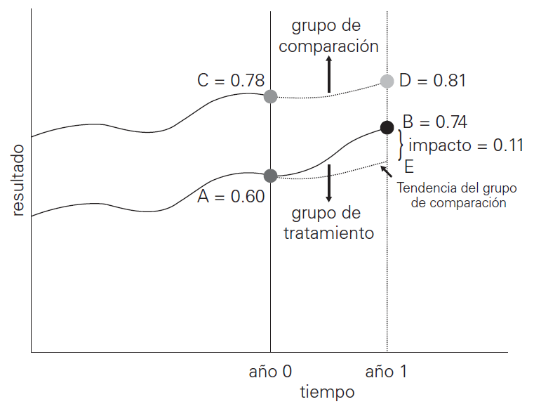
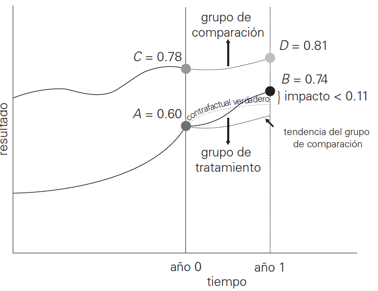

```{r setup, include = F}
# This is the recommended set up for flipbooks
# you might think about setting cache to TRUE as you gain practice --- building flipbooks from scratch can be time consuming
options(width = 70)
knitr::opts_chunk$set(
  dev.args = list(bg = 'transparent'),
  fig.width = 12, message = TRUE,
  warning = FALSE, comment = "", cache = TRUE, fig.retina = 3
)
knitr::opts_knit$set(global.par = TRUE)
Sys.setenv(`_R_S3_METHOD_REGISTRATION_NOTE_OVERWRITES_` = "false")
# remotes::install_github("luukvdmeer/sfnetworks")
# remotes::install_github("EvaMaeRey/flipbookr")
# remotes::install_github("rlesur/klippy")
# devtools::install_github("gadenbuie/xaringanExtra")
library(flipbookr)
library(xaringanthemer)
library(tidyverse)
library(klippy)
library(xaringanExtra)
library(stargazer)
library(scales)
```

<style>
.notbold{
    font-weight:normal
}

body {
text-align: justify;
}

h1{
      margin-top: -1px;
      margin-bottom: -3px;
}

.small-code pre{
  margin-bottom: -10px;
  
}  

.medium-code pre{
  margin-bottom: 2px;
  
} 
</style>

```{r xaringan-scribble, echo=FALSE}
xaringanExtra::use_scribble()
```

```{r xaringanExtra-clipboard, echo=FALSE}
htmltools::tagList(
  xaringanExtra::use_clipboard(
    button_text = "<i class=\"fa fa-clipboard\"></i>",
    success_text = "<i class=\"fa fa-check\" style=\"color: #90BE6D\"></i>",
    error_text = "<i class=\"fa fa-times-circle\" style=\"color: #F94144\"></i>"
  ),
  rmarkdown::html_dependency_font_awesome()
)
```

```{r xaringan-extra-styles, echo=FALSE}
xaringanExtra::use_extra_styles(
  hover_code_line = TRUE,         #<<
  mute_unhighlighted_code = TRUE  #<<
)
```
<font size = "5">

<br>
<br>
<br>
<br>
<br>

Link slides formato [html](https://gusgarciacruz.github.io/EconometriaII/DiD/DiD.html) 

Link slides formato [PDF](https://gusgarciacruz.github.io/EconometriaII/DiD/DiD.pdf) 

---
# <span style="font-size:80%">En este tema</span>

- <span style="font-size:150%">[<span style="color:black">La evaluación de impacto](#impacto)</span> <br>

- <span style="font-size:150%">[<span style="color:black">Evaluación prospectiva versus evaluación retrospectiva](#prospectiva)</span> <br>

- <span style="font-size:150%">[<span style="color:black">Inferencia causal y contrafactuales](#inferencia)</span> <br>

- <span style="font-size:150%">[<span style="color:black">Métodos de evaluación de impacto](#metodos)</span> <br>

- <span style="font-size:150%">[<span style="color:black">Diferencias en diferencias](#DD)</span> <br>

- <span style="font-size:150%">[<span style="color:black">Ejemplo 1 del modelo 2x2 DD](#ejemplo1)</span> <br>

- <span style="font-size:150%">[<span style="color:black">Ejemplo 2 del modelo 2x2 DD](#ejemplo2)</span> <br>

- <span style="font-size:150%">[<span style="color:black">El supuesto de tendencias paralelas](#supuesto)</span> <br>

- <span style="font-size:150%">[<span style="color:black">Ejercicio 1 aplicado en R: efecto de la formación en el empleo sobre los salarios](#r1)</span> <br>

- <span style="font-size:150%">[<span style="color:black">Ejercicio 2 aplicado en R: efecto de Empleando Futuro sobre la formalidad](#r2)</span>


---
# <span style="font-size:80%">Lecturas</span>

- <span style="font-size:150%"> Gertler, P. J., Martínez, S., Premand, P., Rawlings, L. B., Vermeersch, C. M. (2011). [*La evaluación de impacto en la práctica*](https://openknowledge.worldbank.org/entities/publication/f090e5a0-16f6-5795-a3b2-7f711c8b7eb7). Banco Mundial.

- <span style="font-size:150%"> Roth, J., Sant'Anna, P., Bilinski, A., Poe, J. (2023). [What’s trending in difference-in-differences? A synthesis of
the recent econometrics literature](https://www.sciencedirect.com/science/article/pii/S0304407623001318), *Journal of Econometrics*, 235: 2218-2244.

- <span style="font-size:150%"> Wing, C., Simon, K., Bello-Gomez, R. (2018). [Designing Difference in difference studies: best practices for public health
policy research](https://www.annualreviews.org/doi/10.1146/annurev-publhealth-040617-013507), *Annual Review of Public Health*, 39: 453-469.

- <span style="font-size:150%"> Algunas webs: [DS4PS](https://ds4ps.org/PROG-EVAL-III/DiffInDiff.html), [Tidy Finance](https://www.tidy-finance.org/r/difference-in-differences.html), [RE_STAT](https://bookdown.org/cuborican/RE_STAT/difference-in-differences.html),
[DiDs in R](https://lfoswald.github.io/2021-spring-stats2/materials/session-8/08-online-tutorial/)


---
name: impacto
# <span style="font-size:80%">La evaluación de impacto</span>
<spam style="font-size:120%">

- La evaluación de impacto sirve para determinar <span style="color:blue">si un programa ha logrado o no los resultados previstos</span>, y para explorar si existen estrategias alternativas con las que alcanzar mejor dichos resultados

- Las evaluaciones de impacto forman parte de un programa más amplio de <span style="color:blue">formulación de políticas basadas en evidencias</span>. Esta tendencia mundial creciente se caracteriza por un cambio de enfoque: <span style="color:blue">de los insumos a los resultados</span>

- En términos sencillos, una evaluación de impacto <span style="color:blue">evalúa los cambios en el bienestar de las personas que pueden atribuirse a un proyecto, programa o política particular

-  El principal desafío para llevar a cabo evaluaciones eficaces de impacto es identificar <span style="color:blue">la relación causal entre el proyecto</span>, el
programa o la política y los resultados de interés

- Las evaluaciones de impacto son un tipo particular de evaluación que intenta
responder a preguntas sobre <span style="color:blue">causa y efecto</span>

- Las evaluaciones de impacto se preocupan por saber cuál es el <span style="color:blue">impacto o efecto causal</span> de un programa sobre un resultado de interés. Solo interesa el impacto del programa: <span style="color:blue">el efecto directo que tiene en los resultados</span>

---
# <span style="font-size:80%">La evaluación de impacto</span>
<spam style="font-size:120%">

- Para estimar el efecto causal o el impacto de un programa sobre los resultados, cualquier método elegido debe estimar el denominado <span style="color:blue">contrafactual</span> $\Longrightarrow$ <span style="color:blue">cuál habría sido el resultado para los participantes en el programa si no hubieran participado en él

- La evaluación de impacto requiere que el evaluador encuentre <span style="color:blue">un grupo de comparación</span> para estimar lo que habría ocurrido con los participantes sin el programa

- La pregunta fundamental de una evaluación de impacto puede formularse así:

<center><span style="color:red">¿Cuál es el impacto (o efecto causal) de un programa sobre un resultado de interés?</center></span>

- Por ejemplo:
 - ¿Cuál es el efecto causal de las becas sobre la asistencia escolar y el logro
académico? 
 - ¿Cuál es el impacto de la formación para trabajo sobre la formalidad?
 - ¿La mejora de las carreteras mejora el acceso a mercados laborales y aumenta
el ingreso de los hogares?
 - ¿Incrementos en el salario mínimo tienen efectos negativos o positivos sobre el empleo?

---
name: prospectiva
# <span style="font-size:80%">Evaluación prospectiva versus evaluación retrospectiva</span>
<spam style="font-size:120%">

Las evaluaciones de impacto pueden dividirse en dos categorías: <span style="color:blue">prospectivas</span> y <span style="color:blue">retrospectivas</span> 

**<span style="color:blue">Evaluaciones prospectivas**
<p style="margin-bottom: -1em">
- Se realizan al mismo tiempo que se diseña el programa y forman parte de la implementación del programa
- Para ello, se recolectan datos de <span style="color:blue">línea de base de los grupos de tratamiento y de comparación</span> antes de la implementación del programa

**<span style="color:blue">Evaluaciones retrospectivas**</span>
<p style="margin-bottom: -1em">
- Examinan el impacto del programa después de su implementación, lo que genera grupos de tratamiento y de comparación ex post

En general, las evaluaciones prospectivas de impacto tienen más probabilidades
de producir resultados más sólidos y creíbles, por tres motivos:
<p style="margin-bottom: -1em">
1. Levantamiento de una línea base que permite tener información antes de la intervención e identificar que los grupos de tratamiento y comparación sean similares
2. Aclarar los objetivos del programa e identificar la medida de éxito
3. Los grupos de tratamiento y de comparación se identifican antes de la
implementación del programa

---
name: inferencia
# <span style="font-size:80%">Inferencia causal y contrafactuales</span>
<spam style="font-size:110%">

**<span style="color:blue">Inferencia causal**</span>
<p style="margin-bottom: -1em">
- La pregunta básica de la evaluación de impacto es esencialmente un problema de
<span style="color:blue">inferencia causal

- Evaluar el impacto de un programa sobre una serie de resultados es equivalente a <span style="color:blue">evaluar el efecto causal del programa sobre ellos

- Aunque las preguntas sobre causa y efecto son habituales, determinar que <span style="color:blue">una
relación es causal no es tan sencillo

- Las evaluaciones de impacto nos ayudan a <span style="color:blue">atribuir causalidad al establecer empíricamente en qué medida cierto programa, y solo ese programa, ha contribuido a cambiar un resultado

- Para atribuir causalidad entre un programa y un resultado se usan <span style="color:blue">los métodos de evaluación de impacto, que descartan la posibilidad de que cualquier factor distinto del programa de interés explique el impacto observado
- La respuesta a la pregunta básica de la evaluación de impacto, <span style="color:blue">¿Cuál es el impacto o efecto causal de un programa *P* sobre un resultado de interés *Y*?</span>, se obtiene mediante la fórmula básica de la evaluación de impacto:

$$\alpha = (Y|P=1) - (Y|P=0)$$

- Esta formula implica medir *Y* en un momento para la misma unidad de observación (persona, firma, región...), pero en dos realidades diferentes, lo cual no es posible

---
# <span style="font-size:80%">Inferencia causal y contrafactuales</span>
<spam style="font-size:110%">

**<span style="color:blue">Contrafactuales**</span>
<p style="margin-bottom: -1em">
- Como se mencionó, es imposible medir a la misma persona en dos situaciones diferentes en el mismo momento: <span style="color:blue">una persona habrá participado en un programa, o no lo habrá hecho; no se la puede observar simultáneamente en dos estados diferentes

- Este es el <span style="color:blue">problema contrafactual</span>: ¿cómo se
mide lo que habría ocurrido si hubiera prevalecido la otra circunstancia?

- Aunque se puede observar y medir el resultado (*Y*) para los participantes en el
programa $(Y | P = 1)$, <span style="color:blue">no se cuenta con datos para establecer cuál habría sido el resultado en ausencia del programa $(Y | P = 0)$

- En la fórmula básica de la evaluación de impacto, la expresión <span style="color:blue"> $(Y | P = 0)$ representa el contrafactual</span>, que puede entenderse como lo que habría pasado si un participante no hubiera participado en el programa $\Longrightarrow$<span style="color:blue">El contrafactual es lo que habría sido el resultado (*Y*) en ausencia de un programa (P)

- $(Y | P = 0)$ no se puede observar directamente, y de ahí la necesidad de completar esta información mediante la <span style="color:blue">estimación del contrafactual

- Para ello se recurre habitualmente a grupos de comparación o <span style="color:blue">grupos de control</span>

- La identificación de esos grupos de comparación es el quid de cualquier evaluación de impacto $\Longrightarrow$ <span style="color:blue">sin una estimación válida del contrafactual, no se puede conocer el impacto de un programa

---
# <span style="font-size:80%">Inferencia causal y contrafactuales</span>
<spam style="font-size:110%">

**<span style="color:blue">Contrafactuales**</span>
<p style="margin-bottom: -1em">
- Un objetivo clave de una evaluación de impacto es <span style="color:blue">identificar a un grupo de participantes en el programa (el grupo de tratamiento) y a un grupo de no participantes
(el grupo de comparación) estadísticamente idénticos en ausencia del programa

- Si los dos grupos son iguales, a excepción de que uno de ellos participa en el programa y el otro no, <span style="color:blue">cualquier diferencia en los resultados deberá provenir
del programa

- <span style="color:blue">El reto principal es identificar a un grupo de comparación con las mismas características que el grupo de tratamiento</span>. Al menos en tres aspectos deben ser iguales:
<p style="margin-bottom: -1em">
 - ambos grupos deben ser idénticos en ausencia del programa
 - los grupos deben reaccionar de la misma manera al programa
 - ambos grupos no pueden estar expuestos de manera diferente a otras intervenciones durante el período de la evaluación
 
- <span style="color:blue">Cuando el grupo de comparación para una evaluación es inválido, la estimación del impacto del programa también será inválida</span>: no estimará el impacto real del programa. En términos estadísticos, estará sesgada

---
name: metodos
# <span style="font-size:80%">Métodos de evaluación de impacto</span>
<spam style="font-size:120%">

Los métodos o estrategias en la evaluación de impacto consisten en <span style="color:blue">identificar grupos de comparación válidos que reproduzcan o imiten exactamente el contrafactual</span>

Los métodos de evaluación de impacto más comúnmente utilizados son: 
<p style="margin-bottom: -1em">
 - asignación aleatoria
 - promoción aleatoria 
 - diseño de regresión discontinua
 - diferencias en diferencias (DD)
 - pareamiento
 
Los tres primeros métodos estiman el contrafactual a través de reglas explícitas de <span style="color:blue">asignación del programa</span>, que el evaluador conoce y entiende. Estos métodos ofrecen <span style="color:blue">estimaciones creíbles del contrafactual haciendo relativamente pocas suposiciones e imponiendo pocas condiciones. 

Los dos últimos métodos, ofrecen al evaluador herramientas adicionales que pueden aplicarse cuando las <span style="color:blue">reglas de asignación del programa sean menos claras o cuando no sea factible ninguno de los tres métodos antes descritos

---
name: DD
# <span style="font-size:80%">Diferencias en diferencias</span>
<spam style="font-size:120%">

- El método de DD consiste, como indica su nombre, en aplicar una doble diferencia. Compara los cambios a lo largo del tiempo en la variable de interés entre una población inscrita en un programa (el grupo de tratamiento) y una población no inscrita (el grupo de comparación)

- DD estima el contrafactual del cambio en el resultado para el grupo de tratamiento
calculando el cambio del resultado para el grupo de comparación. Este método nos
permite tener en cuenta cualquier diferencia constante en el tiempo entre los
grupos de tratamiento y de comparación

- Para aplicar DD, solo hace falta medir los resultados del grupo que recibe el programa (el grupo de tratamiento) y del grupo que no lo recibe (el grupo de comparación) antes y después del programa

---
# <span style="font-size:80%">Diferencias en diferencias</span>
<spam style="font-size:120%">
<p style="margin-bottom: -1em">
El estimador DD considera:
- cómo cambia la media de un grupo antes y después de una intervención política (grupo de tratamiento) 
- comparar éste cambio con la media a lo largo del tiempo de un grupo similar que no se sometió al tratamiento (grupo de control)

```{r diffindiff, echo=F, fig.align='center', out.width="60%"}

T1 <- 50
T2 <- 85
CF <- 75
C1 <- 35
C2 <- 55

palette( c( adjustcolor( "steelblue", alpha.f = 1), adjustcolor( "darkred", alpha.f = 1)  ) )

plot( c(0, 1, 0, 1), c(T1, T2, C1, C2), bty = "n",
      xlim = c(0, 1), ylim = c(30, 90),
      col = c(1,1,2,2), pch=19, cex=6, 
      xaxt = "n", yaxt = "n",
      xlab = "Tiempo", ylab = "Resultado", 
      main = "Modelo DD", cex.main=2, cex.lab=1.5 
      )

abline(v = 0.5, col="grey", lwd=3, lty=2)

segments( x0=0, x1=1, y0=C1, y1=C2, col=2, lwd=2 )
segments( x0=0, x1=1, y0=T1, y1=T2, col=1, lwd=2 )

text( c(0, 1, 0, 1), c(T1, T2, C1, C2), c(T1, T2, C1, C2), cex = 1.5, col =" white" )

axis(side=1, at=c(0, 0.5, 1), labels=c("Antes", "Intervención","Después"), cex.axis=1.2)
axis(side=2, at=c(30, 50, 70, 90), cex.axis=1.2)

text(x=0.88, y=79, "Tratamiento", col = "steelblue", pos = 4, cex = 1.5 )
text(x=0.93, y=49, "Control", col = "darkred", pos = 4, cex = 1.5 )
```

---
# <span style="font-size:80%">Diferencias en diferencias</span>
<spam style="font-size:116%">

Como sugiere su nombre, el estimador DD es la <span style="color:blue">diferencia de sus diferencias medias</span>. Más claramente, el estimador DD toma:
<p style="margin-bottom: -1em">
- la diferencia en el grupo de tratamiento antes y después del tratamiento (el efecto del tratamiento)
y resta
- la diferencia en el grupo de control antes y después del tratamiento (la tendencia en el tiempo)
como en la siguiente fórmula:

$$(\text{Tratamiento después} - \text{Tratamiento antes}) - (\text{Control después} - \text{Control antes}) = \text{estimación DD}$$
$$(85 - 50) - (55 - 35) = 15$$
Este efecto es lo que en la literatura de evaluación de impacto se llama el <span style="color:blue">efecto medio del tratamiento sobre los tratados</span> o <span style="color:blue">Average Treatment Effect on Treated (ATT)</span>  
<br>
En la siguiente tabla puede verse un cálculo más detallado:

|              | Después | Antes       | Diferencia |
|:-------------|:-------:|:-----------:|:----------:|
| Tratamiento  | 85      | 50          | 35         |
| Control      | 55      | 35          | 20         |
| Diferencias  | 30      | 15          | **<span style="color:blue">15**|

---
# <span style="font-size:80%">Diferencias en diferencias</span>
<spam style="font-size:120%">

- Se podría estar tentado a pensar que la primera diferencia $(\text{Tratamiento después} - \text{Tratamiento antes})$ o la comparación de tratados y no tratados, pueden medir el efecto del programa

- La diferencia de los resultados antes-después del grupo tratado (la primera diferencia) considera factores constantes en el tiempo para dicho grupo, ya que se compara al grupo con sí mismo. Sin embargo, todavía nos quedan los factores externos que varían con el tiempo

- Una manera de observar estos factores variables en el tiempo es medir el cambio antes-después de los resultados de un grupo que no se trató, pero estuvo expuesto a las mismas condiciones ambientales (la segunda diferencia)

- Si se “limpia” la primera diferencia de otros factores variables en el tiempo que afectan al resultado de interés sustrayéndole la segunda diferencia, se habrá eliminado la principal causa de sesgo que nos preocupaba en el caso de las comparaciones simples de antes-después. 

- Por lo tanto, el método de DD combinaría los dos falsos contrafactuales (comparaciones
antes-después y comparaciones tratados-no tratados) para generar una mejor estimación del contrafactual

---
# <span style="font-size:80%">Diferencias en diferencias</span>
<spam style="font-size:120%">

**<span style="color:blue">El clásico 2x2 DD</span>**<br>
El modelo clásico 2x2 DD es la forma más simple del diseño DD y es el caso especial en el cual hay sólo dos grupos observados en dos periodos de tiempo, y cómo vimos es fácilmente representable en la tabla anterior 2x2 

El modelo clásico 2x2 DD tiene la siguiente estructura:

$$y_{it} = \beta_1 + \beta_2Tratamiento_i + \beta_3Post_{it} + \beta_4Tratamiento_i*Post_{it} + \epsilon_{it}$$

donde<br>
$y:$ variable resultado<br>
$Tratamiento:$ variable dummy indicando el grupo de tratamiento $(=1)$ y control $(=0)$<br>
$Post:$ variable dummy indicando pre-tratamiento $(=0)$ y el pos-tratamiento $(=1)$<br>
$Tratamiento*Post:$ variable dummy indicando si la variable de resultado se observó en el grupo de tratamiento y esto fue observado después de la intervención $(=1)$ o en cualquier otro caso $(=0)$

---
# <span style="font-size:80%">Diferencias en diferencias</span>
<spam style="font-size:117%">

**<span style="color:blue">Múltiples grupos y periodos de tiempo (Two-way Fixed Effects - TWFE)</span>**<br>
El diseño DD de dos grupos-dos periodos es muy intuitivo, pero no se ajusta adecuadamente a la realidad, donde pueden haber tratamientos en múltiples grupos y múltiples periodos de tiempo

El <span style="color:blue">modelo general DD</span> con múltiples tratamientos y periodos de tiempo sigue la forma general:
$$y_{it} = \alpha_i + \gamma_t + \beta D_{it}+\epsilon_{it}$$
donde $\alpha_i$ y $\alpha_t$ son efectos fijos de individuo y tiempo, y $D_{it}=Tratamiento_i*Post_{it}$ 

A este modelo le llaman el *Two-way Fixed Effects* (TWFE) al incluir doble efecto fijo asociado a $i$ y $t$. Note que las variables $Tratamiento$ y $Post$ indivuduales del 2x2 DD se subsumen por la estructura de los efectos fijos

La versión dinámica del TWFE para medir el efecto del tratamiento en el tiempo, es la espacificación <span style="color:blue">TWFE *event study*:

$$y_{it} = \beta_1 + \sum_{k=T_0}^{T}\beta_k (Tratamiento_i*t_k) + \alpha_i + \gamma_t + \epsilon_{it}$$
donde $t_k$ es una variable binaria para cada año $k$ y la intervención empieza en $T_0$ para el grupo de tratados

---
name: ejemplo1
# <span style="font-size:80%">Ejemplo 1 del modelo 2x2 DD</span>
<spam style="font-size:120%">

Supongamos que se tiene la siguiente información donde dos individuos son tratados y dos son no tratados, y se registra información sobre la variable de resultado antes y después de la intervención:

| Individuo    | Y       | Tratamiento | Post       |Trat*Post   |
|:-------------|:-------:|:-----------:|:----------:|:----------:|
| 1            | 74      | 1           | 1          | 1          |
| 1            | 46      | 1           | 0          | 0          |
| 2            | 96      | 1           | 1          | 1          |
| 2            | 54      | 1           | 0          | 0          |
| 3            | 50      | 0           | 1          | 0          |
| 3            | 30      | 0           | 0          | 0          |
| 4            | 60      | 0           | 1          | 0          |
| 4            | 40      | 0           | 0          | 0          |

---
# <span style="font-size:80%">Ejemplo 1 del modelo 2x2 DD</span>
<spam style="font-size:120%">
.pull-left-50[
```{r, echo = F}
T = c(1,1,1,1,0,0,0,0)
P = c(1,0,1,0,1,0,1,0)
Y = 35 + 15*T + 20 * P + 15 *T*P
```


```{r echo=FALSE, results='asis'}

reg = lm(Y ~ T + P + T*P)

stargazer( reg, 
           type = "html", 
           dep.var.labels = ("Y"),
           column.labels = c(""),
           covariate.labels = c("<p>&beta;<sub>1</sub></p>", "Tratamiento", "Post", "Trat*Post"),
           omit.stat = "all", 
           digits = 2, intercept.bottom = FALSE, dep.var.caption  = "",
           notes = "Errores estándar en ()")
```
]

.pull-left-50[

| <center> $\beta$      | <center>Interpretación</center>                               | 
|--------------|---------------------------------------------------------------|
| $\beta_1=35$ | Promedio de $Y$ en el grupo de control antes de la intervención    |
| $\beta_2=15$ | Diferencia entre el tratamiento y el control antes de la intervención     |
| $\beta_3=20$ | Cambio en $Y$ del grupo de control después de la intervención    |
| $\beta_4=15$ | <span style="color:blue">Parámetro de ínteres</span>. Cambio en $Y$ del grupo tratado después de la intervención, en comparación con lo que le habría ocurrido al mismo grupo si no se hubiera producido la intervención    |
]

---
# <span style="font-size:80%">Ejemplo 1 del modelo 2x2 DD</span>
<spam style="font-size:110%">

**<span style="color:blue">El contrafactual**<br>
<p style="margin-bottom: -1em">
- Para entender mejor $\beta_4$, debemos examinar mejor el contrafactual. <span style="color:blue">El contrafactual es lo que le habría ocurrido a $Y$, si no se hubiera producido la intervención

- En el modelo DD, el contrafactual es el resultado del grupo de intervención si no se hubiera producido la intervención

- $\beta_4$ representa la diferencia entre el resultado contrafactual y el resultado medio del grupo de tratamiento en el periodo posterior al tratamiento

```{r counterfactual, echo=F, fig.align='center', out.width="53%"}

T1 <- 50
T2 <- 85
CF <- 70
C1 <- 35
C2 <- 55

palette( c( adjustcolor( "steelblue", alpha.f=1), adjustcolor( "darkred", alpha.f=1)  ) )

plot( c(0,1,0,1), c(T1,T2,C1,C2), bty="n",
      xlim=c(0,1), ylim=c(30,90),
      col="gray54", pch=19, cex=6, 
      xaxt="n", yaxt="n",
      xlab="Tiempo", ylab="Resultado", main="Contrafactual", cex.lab=1.5)

abline(v=0.5, col="grey", lwd=3, lty=2)

segments( x0=0, x1=1, y0=C1, y1=C2, col="gray54", lwd=2 )
segments( x0=0, x1=1, y0=T1, y1=T2, col="gray54", lwd=2 )

text( c(0,1,0,1), c(T1,T2,C1,C2), c(T1,T2,C1,C2), cex=1.5, col="white" )

axis(side=1, at=c(0,0.5,1), labels=c("Antes", "Intervención", "Después"), cex.axis=1.2)
axis(side=2, at=c(30,50,70,90),  cex.axis=1.2)

text(x=0.88, y=79, "Tratamiento", col="gray54", pos=4, cex=1.5)
text(x=0.93, y=49, "Control", col="gray54", pos=4, cex=1.5)

# Counterfactual

cf.col <- "darkgreen"

points( 1, CF, cex=6, col=cf.col )
segments(x0=0.021, x1=0.98, y0=50.5, y1=69.7, col=cf.col, lwd=1, lty=2 )
text( 1, CF, CF, col=cf.col, cex=1.5 )
text(x=0.87, y=64, "Contrafactual", col=cf.col, pos=4, cex=1.5)

```

---
name: ejemplo2
# <span style="font-size:80%">Ejemplo 2 del modelo 2x2 DD</span>
<spam style="font-size:120%">

```{r, echo=FALSE, out.width="45%",fig.align='center'}

```

Aquí los dos falsos contrafactuales serían:
<p style="margin-bottom: -1em">
- diferencia antes y despúes de la intervención en los tratados: $(B-A)=0.74-0.60=0.14$
- diferencia después de la interveción entre tratados y control: $(B-D)=0.74-(-0.81)=1.55$

Con DD el impacto o efecto del programa está definido por:

$$(B − A) − (D − C) = (B − E) = (0.74 − 0.60) − (0.81 − 0.78) = 0.11$$

---
name: supuesto
# <span style="font-size:80%">El supuesto de tendencias paralelas</span>
<spam style="font-size:120%">

- El método de DD supone que <span style="color:blue">muchas características de las unidades o las personas son constantes (o invariables en el tiempo)

- Para que DD genere una estimación válida del contrafactual, se debe <span style="color:blue">suponer la inexistencia de diferencias que aparecen a lo largo del tiempo entre los grupos de tratamiento y de comparación

- Es decir que en ausencia del programa, <span style="color:blue">las diferencias en los resultados entre los grupos de tratamiento y de comparación tendrían que evolucionar paralelamente</span> $\Longrightarrow$ <span style="color:blue">sin el tratamiento, los resultados aumentarían o disminuirían al mismo ritmo en ambos grupos</span>; es decir, es necesario que los resultados reflejen tendencias iguales en ausencia del tratamiento

- Lamentablemente, no existe una manera de demostrar que las diferencias entre los grupos de tratamiento y de comparación habrían evolucionado paralelamente en ausencia del programa. <span style="color:blue">Esto se debe a que no se puede observar lo que le habría pasado al grupo de tratamiento en ausencia del tratamiento</span> $\Longrightarrow$ <span style="color:blue">¡no se puede observar el contrafactual!

- Por lo tanto, cuando se usa el método de DD, se debe suponer que, <span style="color:blue">en ausencia del programa, el resultado del grupo de tratamiento habría evolucionado paralelamente al grupo de control

---
# <span style="font-size:80%">El supuesto de tendencias paralelas</span>
<spam style="font-size:100%">

```{r, echo=FALSE, out.width="40%",fig.align='center'}

```

- Si las tendencias de los resultados son diferentes para los grupos de tratamiento y de comparación, <span style="color:blue">el efecto estimado de tratamiento obtenido mediante métodos de DD será inválido o sesgado</span>. Esto se debe a que <span style="color:blue">la tendencia del grupo de comparación no es una estimación válida de la tendencia del contrafactual

- Como se ve en el gráfico, los resultados del grupo de comparación crecen más lentamente que los resultados del grupo de tratamiento en ausencia del programa

- El uso de la tendencia del grupo de comparación como estimación de la “tendencia contrafactual” del grupo de tratamiento provoca una sobreestimación del impacto del programa

---
# <span style="font-size:80%">El supuesto de tendencias paralelas</span>
<spam style="font-size:110%">

A pesar de que no se puede demostrar el supuesto fundamental de igualdad de tendencias, se puede comprobar. En la literatura existen cuatro formas regularmente utilizadas para corrorborar el supuesto: 


<span style="color:blue">*Testing for pre-trends*</span><br>
Una técnica comúnmente utilizada para probar tendencias paralelas antes del tratamiento, es el estudio de eventos (*event-study*)
 
La idea de este método consiste en incluir la interacción entre las variables binarias de tiempo antes y después de la fecha de la intervención y el indicador de tratamiento como variables explicativas de la variable resultado a analizar
 
Para comprobar la igualdad de las tendencias antes de la intervención, se necesitan al menos dos rondas de datos para los grupos de tratamiento y de comparación antes del comienzo del programa
 
Se estima el siguiente *event-study*, con $t$ siendo una variable binaria de tiempo:

$$y_{it} = \beta_1 + \underbrace{\sum_{k=T_0^*}^{T_{0}-1}\theta_k (Tratamiento_i*t_k)}_{Pretratamiento} + \underbrace{\sum_{\tau=T_1}^{T}\delta_\tau (Tratamiento_i*t_\tau)}_{Postratamiento} + \alpha_i + \gamma_t + \epsilon_{it}$$
Para corroborar que la tendencia entre los grupos de tratamiento y control es la misma, se debe probar que los coeficientes asociados al pretratamiento no son estadísticamente significantes

---
# <span style="font-size:80%">El supuesto de tendencias paralelas</span>
<spam style="font-size:120%">

<span style="color:blue">*Placebo test*</span><br>
los investigadores pueden probar si se observó un efecto en una muestra diferente que no debería haberse visto afectada por la intervención 

En esta prueba placebo, $\theta$ es el cambio en el resultado en el grupo que no debería verse afectado por la intervención

Esto podría implicar el uso del mismo modelo de DD en una población diferente, y ver si hay un efecto medio significativo del tratamiento

---
name: r1
# <span style="font-size:80%">Ejercicio 1 aplicado en R: efecto de la formación en el empleo sobre los salarios</span>
<spam style="font-size:100%">

La *National Supported Work* (NSW) en los Estados Unidos, llevó acabo en los 70 un análisis sobre el impacto de la formación en el empleo sobre los salarios. El programa fue realizado entre 1976 y 1977. Hay 185 tratados y un grupo de control de 2490. La variable de resultado a analizar son los salarios reales, y se cuenta con información en el pretratamiento en 1974 y 1975, y en el postratamiento en 1978 (Lalonde, 1986; Dehejia y Wahba, 1999, 2002). La base de datos [nswpsid.dta](https://cameron.econ.ucdavis.edu/mmabook/nswpsid.dta) cuenta con las siguientes principales variables:
<p style="margin-bottom: -1em">

| <center> Variable | <center>Definición</center>   | 
|-------------------|-------------------------------|
| treat             | 1=tratados, 0=control         |
| age               | Edad en años                  |
| educ              | Número de años de educación   |
| black             | 1=afrodescendiente, 0=no afro |
| re74              | Salario real en 1974          |
| re75              | Salario real en 1975          |
| re78              | Salario real en 1978          |

En el siguiente link se encuentra el código utilizado en R:
<p style="margin-bottom: -1em">
- [Código en R](https://gusgarciacruz.github.io/EconometriaII/DiD/DiD1.R)

---
name: r2
# <span style="font-size:80%">Ejercicio 2 aplicado en R: efecto de Empleando Futuro sobre la formalidad</span>
<spam style="font-size:120%">

En este ejercicio se va a realizar una aplicación del modelo de Diferencias en Diferencias (DD) para analizar el efecto causal de [Empleando Futuro](https://www.sibs.co/iniciativa/empleado-del-futuro/). Este programa fue el primer [Bono de Impacto Social (BIS)](https://prosperidadsocial.gov.co/sobre-los-bis/) implementado en Colombia y Latinoamérica, y tenía como objetivo fomentar la inserción laboral y retención de la población vulnerable. 

Empleando Futuro se ejecutó entre marzo de 2017 y diciembre de 2018 en Cali, Pereira y Bogotá. Este ejercicio se basa en el documento de [Chaparro, García y Cardona (2020)](https://www.sibs.co/wp-content/uploads/2023/11/Evaluacion-de-Impacto_Empleando-Futuro_2020.pdf) donde se encuentra más detallada la evaluación de impacto de Empleando Futuro.

Todo el ejercicio, junto con el código, se encuentra en el siguiente link:
- [Empleando Futuro](https://gusgarciacruz.github.io/EconometriaII/DiD/EmpleandoFuturo.html)