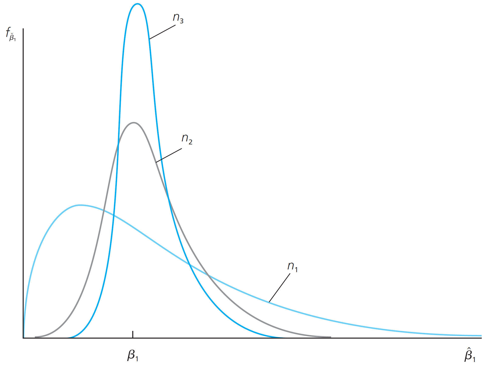

```{r setup, include = F}
# This is the recommended set up for flipbooks
# you might think about setting cache to TRUE as you gain practice --- building flipbooks from scratch can be time consuming
options(width = 70)
knitr::opts_chunk$set(
  dev.args = list(bg = 'transparent'),
  fig.width = 12, message = TRUE,
  warning = FALSE, comment = "", cache = TRUE, fig.retina = 3
)
knitr::opts_knit$set(global.par = TRUE)
Sys.setenv(`_R_S3_METHOD_REGISTRATION_NOTE_OVERWRITES_` = "false")
# remotes::install_github("luukvdmeer/sfnetworks")
# remotes::install_github("EvaMaeRey/flipbookr")
# remotes::install_github("rlesur/klippy")
# devtools::install_github("gadenbuie/xaringanExtra")
library(flipbookr)
library(xaringanthemer)
library(tidyverse)
library(klippy)
library(xaringanExtra)
```

<style>
.notbold{
    font-weight:normal
}

body {
text-align: justify;
}

h1{
      margin-top: -1px;
      margin-bottom: -3px;
}

.small-code pre{
  margin-bottom: -10px;
  
}  

.medium-code pre{
  margin-bottom: 2px;
  
} 
</style>

```{r xaringan-scribble, echo=FALSE}
#xaringanExtra::use_scribble()
```

```{r xaringanExtra-clipboard, echo=FALSE}
htmltools::tagList(
  xaringanExtra::use_clipboard(
    button_text = "<i class=\"fa fa-clipboard\"></i>",
    success_text = "<i class=\"fa fa-check\" style=\"color: #90BE6D\"></i>",
    error_text = "<i class=\"fa fa-times-circle\" style=\"color: #F94144\"></i>"
  ),
  rmarkdown::html_dependency_font_awesome()
)
```

```{r xaringan-extra-styles, echo=FALSE}
xaringanExtra::use_extra_styles(
  hover_code_line = TRUE,         #<<
  mute_unhighlighted_code = TRUE  #<<
)
```
<font size = "5">

<br>
<br>
<br>
<br>
<br>

Link slides en formato [html](https://gusgarciacruz.github.io/EconometriaII/MCO/MCO.html)

Link slides en formato [PDF](https://gusgarciacruz.github.io/EconometriaII/MCO/MCO.pdf)
---
# <span style="font-size:80%">En este tema</span>

- <span style="font-size:150%">[<span style="color:black">El modelo](#modelo)</span> <br> <br>

- <span style="font-size:150%"> [<span style="color:black">Estimación MCO](#estimacion)</span> <br> <br>

- <span style="font-size:150%"> [<span style="color:black">Propiedades de los estimadores MCO](#propiedades)</span> <br> <br>

- <span style="font-size:150%"> [<span style="color:black">Ejercicio aplicado en R: tasas de retorno a la educación](#r)</span>

---
# <span style="font-size:80%">Lecturas</span>
- <span style="font-size:150%">Wooldridge, J. (2013). *Introducción a la econometría*. 5a edición, Cengage Learning. <span style="color:blue">Caps 3, 4, 5 <br> <br>

- <span style="font-size:150%"> Gujarati, D. y Porter, D. (2010). *Econometría*. 5a edición, Mc Graw Hill. <span style="color:blue">Caps 7, 8 <br> <br>

- <span style="font-size:150%"> Judge, G., Hill, R., Griffiths, W., Lütkepohl, H. y Lee, T. (1988). *Introduction to the theory and practice of econometrics*. 2a edición, John Wiley & Sons. <span style="color:blue">Cap. 5

---
name: modelo
# <span style="font-size:80%">El modelo</span>

Un modelo de regresión lineal múltiple tiene la siguiente estructura:

$$Y_{i} = \beta_{1} + \beta_{2}X_{i2} + \beta_{3}X_{i3}+...+ \beta_{k}X_{ik} + u_{i}$$
El modelo entonces contiene $k$ parámetros poblacionales (desconocidos). Se trabaja, entonces, con $n-k$ gdl

Recordando los <font color = "blue">supuestos iniciales</font>:

- Los coeficientes $\beta_{j}$ con $j=1,2,3,...,k$ son fijos y desconocidos

- Las $X_{ij}$ son estocásticamente fijas para $j=2,3,4,...,k$. Este es un supuesto de partida propio del laboratorio. Un supuesto más real en economía y que lleva a resultados similares es: las variables explicatorias son exógenas. Esto implica que:
$$Cov(X_{i2},u_{i})=0$$
$$Cov(X_{i3},u_{i})=0$$
$$\vdots$$
$$Cov(X_{ik},u_{i})=0$$
- El modelo esta completo: $E(u_{i})=0, \forall i= 1...n$
- Homoscedasticidad: $Var(u_{i})=E(u_{i}-E(u_{i}))^2=E(u_{i}^2)=\sigma_{u}^2$
- No autocorrelación: $Cov(u_{i},u_{j})=E[(u_{i}-E(u_{i}))(u_{j}-E(u_{j}))]=E(u_{i}u_{j})=0, \forall i\neq j$
- Normalidad: $u_{i}\sim NID(0,\sigma_{u}^2)$

---
# <span style="font-size:80%">El modelo</span>

El modelo general es un polinomio de regresión de la forma:

$$Y_{i} = {\beta}_{1} + {\beta}_{2}X_{i2} + {\beta}_{3}X_{i3} +...+ {\beta}_{k}X_{ik} + {u}_{i}$$

Lo que el modelo dice es:
$$Y_{1} = {\beta}_{1} + {\beta}_{2}X_{12} + {\beta}_{3}X_{13} +...+ {\beta}_{k}X_{1k} + {u}_{1}$$
$$Y_{2} = {\beta}_{1} + {\beta}_{1}X_{22} + {\beta}_{3}X_{23} +...+ {\beta}_{k}X_{2k} + {u}_{2}$$
$$\vdots$$
$$Y_{n} = {\beta}_{1} + {\beta}_{2}X_{n2} + {\beta}_{3}X_{n3} +...+ {\beta}_{k}X_{nk} + {u}_{n}$$
En matrices se tiene
$$\textbf{Y}_{n\mbox{x}1} = \left[ \begin{array}{c}
Y_{1} \\
Y_{2} \\
\vdots \\
Y_{n}\\ \end{array} \right] \  \ \ \ \textbf{u}_{n\mbox{x}1} = \left[ \begin{array}{c}
u_{1} \\
u_{2} \\
\vdots \\
u_{n}\\ \end{array} \right] \  \ \ \  \textbf{B}_{k\mbox{x}1} = \left[ \begin{array}{c}
\beta_{1} \\
\beta_{2} \\
\vdots \\
\beta_{k}\\ \end{array} \right] \  \ \ \ \textbf{X}_{n\mbox{x}k} = \left[ \begin{array}{cccc}
1 & X_{12} & X_{23} & X_{1k} \\
1 & X_{22} & X_{23} & X_{2k} \\
\vdots \\
1 & X_{n2} & X_{n3} & X_{nk}\\ \end{array} \right]$$

En esta notación $X_{ij}$ indica: fila $i$ (observación), columna $j$ (variable explicatoria). El polinomio de regresión en álgebra matricial se puede escribir como:
$$\textbf{Y}_{n\mbox{x}1} = \textbf{X}_{n\mbox{x}k}\textbf{B}_{k\mbox{x}1} + \textbf{u}_{n\mbox{x}1}$$

---
# <span style="font-size:80%">El modelo</span>
La especificación del modelo de Regresión Lineal Múltiple (RLM) haciendo uso del álgebra matricial se tiene

$$\textbf{Y} = \textbf{X}\textbf{B} + \textbf{u}$$
- Modelo completo: $E(\textbf{u})=\textbf{0}$

- Exogeneidad: $E(\textbf{X}'\textbf{u})=\textbf{0}$

- Perturbaciones esféricas: $Cov(\textbf{u})=E(\textbf{u}\textbf{u}')=\sigma_{u}^2\textbf{I}_{n}$
	(homocedasticidad y no autocorrelación)
- No multicolinealidad perfecta: $\rho(\textbf{X}_{n\mbox{x}k})=k<n$

- Normalidad: $\textbf{u}_{n\mbox{x}1}\sim \textbf{N}(\textbf{0}_{n\mbox{x}1},\sigma_{u}^2\textbf{I}_{n})$

---
name: estimacion
# <span style="font-size:80%">Estimación MCO</span>

Se construye matricialmente la sumatoria de cuadrados de los residuales $(SCR)$ y se deriva respecto a $\hat{\textbf{B}}$

El modelo estimado es $\textbf{Y}=\textbf{X}\hat{\textbf{B}} + \hat{\textbf{u}}$ y sin necesidad de supuestos se sabe que
$$\hat{\textbf{u}} = \left[ \begin{array}{c}
\hat{u}_{1}\\
\hat{u}_{2}\\
\vdots\\
\hat{u}_{n}\\ \end{array} \right]$$

y por ende la $SCR = \sum \hat{u}_{i}^2 = \hat{u}_{1}^2 + \hat{u}_{2}^2 +...+\hat{u}_{n}^2 = \hat{\textbf{u}}'\hat{\textbf{u}}$

Si se transpone un vector y se premultiplica por el vector original se obtiene la suma de cuadrados de los elementos del vector 

$$
\begin{aligned}
SCR=\hat{\textbf{u}}'\hat{\textbf{u}} & = (\textbf{Y}-\textbf{X}\hat{\textbf{B}})'(\textbf{Y}-\textbf{X}\hat{\textbf{B}})\\
                        & =(\textbf{Y}'-\hat{\textbf{B}}'\textbf{X}')(\textbf{Y}-\textbf{X}\hat{\textbf{B}})\\
                        & =\textbf{Y}'\textbf{Y} - \textbf{Y}'\textbf{X}\hat{\textbf{B}} - \hat{\textbf{B}}'\textbf{X}'\textbf{Y} + \hat{\textbf{B}}'\textbf{X}'\textbf{X}\hat{\textbf{B}}
\end{aligned}
$$

Se tiene que $(\hat{\textbf{B}}'\textbf{X}'\textbf{Y})'= \textbf{Y}'\textbf{X}\hat{\textbf{B}}$ y que $\hat{\textbf{B}}'\textbf{X}'\textbf{Y}$ y $\textbf{Y}'\textbf{X}\hat{\textbf{B}}$ son dos escalares iguales, entonces

$$SCR=\hat{\textbf{u}}'\hat{\textbf{u}}=\textbf{Y}'\textbf{Y} - \underbrace{2\hat{\textbf{B}}'\textbf{X}'\textbf{Y}}_{\mbox{forma lineal en } \hat{\textbf{B}}} + \underbrace{\hat{\textbf{B}}'\textbf{X}'\textbf{X}\hat{\textbf{B}}}_{\mbox{forma cuadrática en } \hat{\textbf{B}}}$$

---
# <span style="font-size:80%">Estimación MCO</span>

Derivando respecto a $\hat{\textbf{B}}$ e igualando a cero

$$
\begin{aligned}
\frac{\partial \hat{\textbf{u}}'\hat{\textbf{u}}}{\partial \hat{\textbf{B}}} & \Longrightarrow \frac{\partial \textbf{Y}'\textbf{Y}}{\partial \hat{\textbf{B}}}=\textbf{0}\\
                       & \Longrightarrow \frac{\partial 2\hat{\textbf{B}}'\textbf{X}'\textbf{Y}}{\partial \hat{\textbf{B}}}=2\textbf{X}'\textbf{Y}\\
                       & \Longrightarrow \frac{\partial \hat{\textbf{B}}'\textbf{X}'\textbf{X}\hat{\textbf{B}}}{\partial \hat{\textbf{B}}}=2(\textbf{X}'\textbf{X})\hat{\textbf{B}}
\end{aligned}
$$

$$\frac{\partial \hat{\textbf{u}}'\hat{\textbf{u}}}{\partial \hat{\textbf{B}}} = -2\textbf{X}'\textbf{Y} + 2(\textbf{X}'\textbf{X})\hat{\textbf{B}}=\textbf{0}$$

$$(\textbf{X}'\textbf{X})\hat{\textbf{B}}=\textbf{X}'\textbf{Y}: \text{Ecuaciones normales}$$


<font color = "blue">$$\hat{\textbf{B}}_{MCO}=(\textbf{X}'\textbf{X})^{-1}\textbf{X}'\textbf{Y}$$

---
name: propiedades
# <span style="font-size:80%">Propiedades de los estimadores MCO</span>
<p style="margin-bottom: -1em">
**<font color = "blue">Linealidad</font>**

Es demostrar que $\hat{\textbf{B}}=(\textbf{X}'\textbf{X})^{-1}\textbf{X}'\textbf{Y}$ es lineal en $Y$ y en $u$. Observando el vector $\hat{\textbf{B}}$ se puede hacer lo siguiente
	
$$\hat{\textbf{B}}=\textbf{(}(\textbf{X}'\textbf{X})^{-1}\textbf{X}'\textbf{)}_{k\mbox{x}n}\textbf{Y}_{n\mbox{x}1}$$

	
Se puede definir una matriz de ${k\mbox{x}n}$
$$\textbf{C}_{k\mbox{x}n}'=(\textbf{X}'\textbf{X})^{-1}\textbf{X}'$$
<p style="margin-bottom: -1em">
Entonces
$$\hat{\textbf{B}}=\textbf{C}'\textbf{Y}$$
<p style="margin-bottom: -1em">
Con

$$\textbf{C}' = \left[ \begin{array}{cccc}
C_{11}     &   C_{12}    &  \cdots &  C_{1n} \\
C_{21}     &   C_{22}    &  \cdots &  C_{2n} \\
\vdots     &   \vdots    &  \vdots &  \vdots \\ 
C_{k1}     &   C_{k2}    &  \cdots &  C_{kn} \\
\end{array} \right]$$

Cada estimador $\hat{\beta}_{j}, j=1,2,...,k,$ puede escribirse como
$$\hat{\beta}_{j} = \sum C_{ij}Y_{i}$$
combinación lineal en $Y_{i}$ 

---
# <span style="font-size:80%">Propiedades de los estimadores MCO</span>
<p style="margin-bottom: -1em">
**<font color = "blue">Linealidad</font>**

De la misma forma
$$\hat{\textbf{B}}=\textbf{C}'\textbf{Y}=\textbf{C}'(\textbf{X}\textbf{B} + \textbf{u})=\textbf{C}'\textbf{X}\textbf{B} + \textbf{C}'\textbf{u}$$

Se observa que
$$\textbf{C}'\textbf{X}=(\textbf{X}'\textbf{X})^{-1}\textbf{X}'\textbf{X}=\textbf{I}_{k}$$
Entonces
$$\hat{\textbf{B}}=\textbf{B} + \textbf{C}'\textbf{u}$$
Expresión aleatoria de $\hat{\textbf{B}}$. Donde cada $\hat{\beta}_{j}$ es

$$\hat{\beta}_{j}=\beta_{j} + \sum C_{ij}u_{i}$$
Una combinación lineal en $u_{i}$

---
# <span style="font-size:80%">Propiedades de los estimadores MCO</span>
<p style="margin-bottom: -1em">
**<font color = "blue">Insesgadez</font>**
<p style="margin-bottom: -1em">
Partiendo de la expresión aleatoria

$$E(\hat{\textbf{B}})=E(\textbf{B} + \textbf{C}'\textbf{u})=\textbf{B} + \textbf{C}'E(\textbf{u})=\textbf{B}$$
<p style="margin-bottom: -1em">
**<font color = "blue">Mínima varianza</font>**

Primero calculamos la matriz de varianzas-covarianzas de $\hat{\textbf{B}}$ y luego corroboramos el Teorema de Gauss-Markov para demostrar que la varianza calculada es mínima

$$Cov(\hat{\textbf{B}}) = E[(\hat{\textbf{B}}-E(\hat{\textbf{B}}))(\hat{\textbf{B}}-E(\hat{\textbf{B}}))'] = E[(\hat{\textbf{B}}-\textbf{B})(\hat{\textbf{B}}-\textbf{B})']$$
<p style="margin-bottom: -1em">
De la expresión aleatoria tenemos que 
<p style="margin-bottom: -1em">
$$\hat{\textbf{B}}=\textbf{B} + (\textbf{X}'\textbf{X})^{-1}\textbf{X}'\textbf{u}$$
<p style="margin-bottom: -1em">
$$\hat{\textbf{B}}-\textbf{B}= (\textbf{X}'\textbf{X})^{-1}\textbf{X}'\textbf{u}$$
<p style="margin-bottom: -1em">
$$(\hat{\textbf{B}}-\textbf{B})'= \textbf{u}'\textbf{X}(\textbf{X}'\textbf{X})^{-1}$$
<p style="margin-bottom: -1em">
Entonces

$$Cov(\hat{\textbf{B}}) = E[(\hat{\textbf{B}}-\textbf{B})(\hat{\textbf{B}}-\textbf{B})']= E[(\textbf{X}'\textbf{X})^{-1}\textbf{X}'\textbf{u}\textbf{u}'\textbf{X}(\textbf{X}'\textbf{X})^{-1}]
= (\textbf{X}'\textbf{X})^{-1}\textbf{X}'E(\textbf{u}\textbf{u}')\textbf{X}(\textbf{X}'\textbf{X})^{-1}$$

Por el supuesto de perturbaciones esféricas $E(\textbf{u}\textbf{u}') = \sigma_{u}^2 \textbf{I}_{n}$

$$Cov(\hat{\textbf{B}}) = \sigma_{u}^2 (\textbf{X}'\textbf{X})^{-1}\underbrace{\textbf{X}'\textbf{X}(\textbf{X}'\textbf{X})^{-1}}_{\textbf{I}_{k}}$$
<font color = "blue">$$Cov(\hat{\textbf{B}}) = \sigma_{u}^2 (\textbf{X}'\textbf{X})^{-1}$$

---
# <span style="font-size:80%">Propiedades de los estimadores MCO</span>
<p style="margin-bottom: -1em">
**<font color = "blue">Consistencia</font>**

- Aunque la insesgadez de los estimadores es importante, no siempre puede lograrse: por ejemplo $\widehat{\sigma}^2_{u}$ es sesgado
- Aunque no todos los estimadores útiles son insesgados, casi todos los economistas están de acuerdo en que la <font color = "blue">consistencia</font> es un requisito mínimo para un estimador
- Si el estimador de un determinado parámetro poblacional no es consistente, entonces se está perdiendo el tiempo
- $\widehat{\beta}_{j}$ es un estimador de $\beta_{j}$ y como es insesgado la distribución de probabilidad de $\widehat{\beta}_{j}$ tiene una media de $\beta_{j}$. <font color = "blue">Como estimador consistente, entonces a medida que el tamaño de la muestra aumenta, la distribución de $\widehat{\beta}_{j}$ se estrechará cada vez más entorno a $\beta_{j}$</font>
- Esto significa que si es posible recolectar tantos datos como se desee, entonces puede hacerse que el estimador esté arbitrariamente cerca de $\beta_{j}$

```{r, echo=FALSE, out.width="37%",fig.align='center'}

```

---
# <span style="font-size:80%">Propiedades de los estimadores MCO</span>
<p style="margin-bottom: -1em">
**<font color = "blue">Normalidad asintótica</font>**

- Se sabe que la normalidad no juega ningún papel en la insesgadez de los estimadores MCO y tampoco afecta las conclusiones de MCO es el mejor estimador lineal insesgado bajo los supuestos estándar

- Pero la inferencia exacta basada en los estadísticos $t$ y F requiere el supuesto que los errores se distribuyen normal

- Aunque las $Y_{i}$ no provienen de una distribución normal, puede emplearse el teorema central del límite para concluir que los estimadores de MCO satisfacen la <font color = "blue">normalidad asintótica</font>, <font color = "blue">lo cual significa que están distribuidos de manera aproximadamente norma cuando se tienen muestras de tamaño suficientemente grande</font>

- Este teorema indica es que, sin importar la distribución de la población de $u$, los estimadores de los MCO, cuando se estandarizan de manera apropiada, tienen distribuciones normales estándar aproximadas

---
name: r
# <span style="font-size:80%">Ejercicio aplicado en R: tasas de retorno a la educación</span>

```{r}
library(wooldridge); library(tidyverse); library(summarytools); library(modelsummary); library(gt)

data('wage1')

```

Estimación por OLS

.small-code[
.pull-left-50[
```{r}
ols1 <- lm(lwage ~ educ, data = wage1)
summary(ols1)
```
]

.pull-right-50[
```{r}
ols2 <- lm(lwage ~ educ + female, data = wage1)
summary(ols2)
```
]
]

---
# <span style="font-size:80%">Ejercicio aplicado en R: tasas de retorno a la educación</span>
<font size = "3">
Utilizamos el paquete [```modelsummary```](https://vincentarelbundock.github.io/modelsummary/articles/modelsummary.html) para generar tablas editadas (Word, tex, text, png, html...)
```{r}
modelos <- list("OLS1" = lm(lwage ~ educ, data = wage1),
                "OLS2"  = lm(lwage ~ educ + female, data = wage1))
                
modelsummary(modelos, output = 'gt', coef_map = c('educ' = 'Educación', 'female' = 'Mujer (=1)'), stars = c('*'=.1, '**'=.05, '***'=.01), statistic = "std.error", title = 'Tabla 1. Determinantes de los salarios (Y = log(salario))', gof_omit = 'IC|Log|RMSE') |> 
tab_style(style = cell_text(size = "x-small"), locations = cells_source_notes()) |>  tab_source_note(source_note = "Nota: Errores estándar en paréntesis")
```