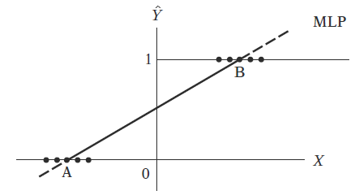
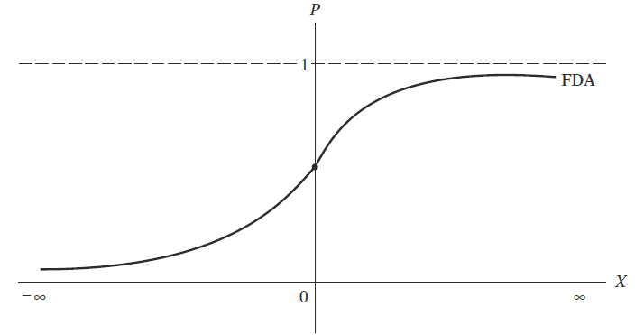
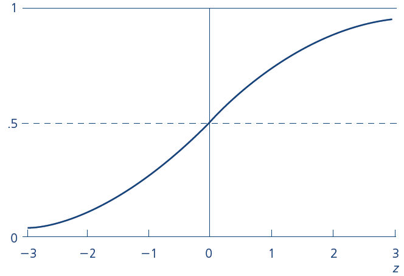
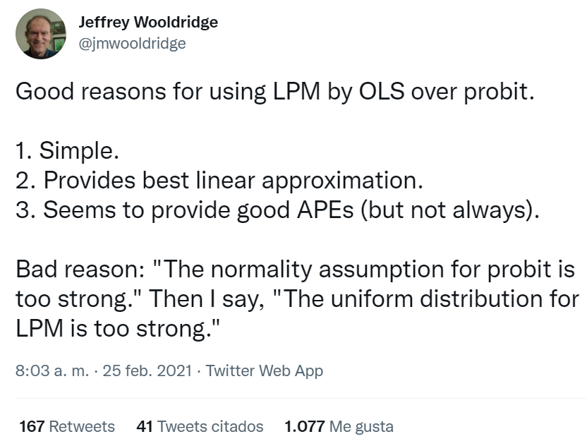

```{r setup, include = F}
# This is the recommended set up for flipbooks
# you might think about setting cache to TRUE as you gain practice --- building flipbooks from scratch can be time consuming
options(width = 70)
knitr::opts_chunk$set(
  dev.args = list(bg = 'transparent'),
  fig.width = 12, message = TRUE,
  warning = FALSE, comment = "", cache = TRUE, fig.retina = 3
)
knitr::opts_knit$set(global.par = TRUE)
Sys.setenv(`_R_S3_METHOD_REGISTRATION_NOTE_OVERWRITES_` = "false")
# remotes::install_github("luukvdmeer/sfnetworks")
# remotes::install_github("EvaMaeRey/flipbookr")
# remotes::install_github("rlesur/klippy")
# devtools::install_github("gadenbuie/xaringanExtra")
library(flipbookr)
library(xaringanthemer)
library(tidyverse)
library(klippy)
library(xaringanExtra)
```

<style>
.notbold{
    font-weight:normal
}

body {
text-align: justify;
}

h1{
      margin-top: -1px;
      margin-bottom: -3px;
}

.small-code pre{
  margin-bottom: -10px;
  
}  

.medium-code pre{
  margin-bottom: 2px;
  
} 
</style>

```{r xaringan-scribble, echo=FALSE}
xaringanExtra::use_scribble()
```

```{r xaringanExtra-clipboard, echo=FALSE}
htmltools::tagList(
  xaringanExtra::use_clipboard(
    button_text = "<i class=\"fa fa-clipboard\"></i>",
    success_text = "<i class=\"fa fa-check\" style=\"color: #90BE6D\"></i>",
    error_text = "<i class=\"fa fa-times-circle\" style=\"color: #F94144\"></i>"
  ),
  rmarkdown::html_dependency_font_awesome()
)
```

```{r xaringan-extra-styles, echo=FALSE}
xaringanExtra::use_extra_styles(
  hover_code_line = TRUE,         #<<
  mute_unhighlighted_code = TRUE  #<<
)
```
<font size = "5">

<br>
<br>
<br>
<br>
<br>

Link slides formato [html](https://gusgarciacruz.github.io/EconometriaII/ModelosEleccion/ModelosEleccion.html) 

Link slides formato [PDF](https://gusgarciacruz.github.io/EconometriaII/ModelosEleccion/ModelosEleccion.pdf) 
---
# <span style="font-size:80%">En este tema</span>

- <span style="font-size:150%">[<span style="color:black">Motivación](#motivacion)</span> <br> <br>

- <span style="font-size:150%">[<span style="color:black">Economía y los modelos de elección discreta](#economia)</span> <br> <br>

- <span style="font-size:150%">[<span style="color:black">Modelo de probabilidad lineal (MPL)](#mpl)</span> <br> <br>

- <span style="font-size:150%">[<span style="color:black">Limitaciones del MPL](#limitaciones)</span> <br> <br>

- <span style="font-size:150%">[<span style="color:black">Modelos logit y probit](#logit)</span> <br> <br>

- <span style="font-size:150%">[<span style="color:black">Qué modelo seleccionar entre el MPL, probit o logit? Preguntémosle a Wooldridge](#wooldridge)</span> <br> <br>

- <span style="font-size:150%">[<span style="color:black">Ejercicio aplicado en R: Efectos de la educación sobre el crimen](#r)</span> <br>
---
# <span style="font-size:80%">Lecturas</span>
- <span style="font-size:150%">Wooldridge, J. (2013). *Introducción a la econometría. Un enfoque moderno*. 5a edición. Cenagage Learning <span style="color:blue">Sección 7.5, Cap 17 <br>

- <span style="font-size:150%">Gujarati, D. y Porter, D. (2010). *Econometría*. 5a edición, Mc Graw Hill. <span style="color:blue">Cap. 15 <br>

---
name: motivacion
# <span style="font-size:80%">Motivación</span>
<font size = "5">
- En los modelos vistos hasta ahora, la variable dependiente $y$ ha tenido un significado *cuantitativo* (por ejemplo, $y$ ha sido una cantidad de dólares, la puntuación en un exámen, un porcentaje, o el logaritmo de éstos). La pregunta que surge es: <span style="color:blue">¿Qué ocurre cuando se desea usar la regresión múltiple para explicar eventos cualitativos?</span>

- En el caso más sencillo, y que en la práctica se encuentra con frecuencia, el evento que se desea explicar tiene un resultado <span style="color:blue">binario</span>

- Respuesta binaria: <span style="color:blue">la variable $y$ sólo toma los valores 0 y 1</span>. Por ejemplo, $y$ puede indicar
	- si un adulto tiene o no educación universitaria
	- si un estudiante universitario consume o no drogas durante un año escolar
	- si una empresa ha sido absorbida por otra durante un determinado año
	- si el individuo está o no desempleado
	- si el individuo es o no un trabajador informal
	- si el individuo toma transporte público o no para desplazarse a su empleo

---
# <span style="font-size:80%">Economía y los modelos de elección discreta</span>
<font size = "5">

La interpretación económica de los modelos de elección discreta parte de <span style="color:blue">la utilidad</span>, donde se especifica que la racionalidad de los agentes económicos hace que se comporten de forma que <span style="color:blue">maximicen la utilidad</span> esperada que les proporciona cada una de las opciones posibles sobre lo que deben decidir

Ejemplos:

<span style="color:blue">Participación laboral</span>: los individuos deciden trabajar si la utilidad que le proporciona esa elección supera la utilidad de no hacerlo (una vez considerados los beneficios y costos de la elección)
	
<span style="color:blue">Lanzamiento de un nuevo producto</span>: un empresario decidirá lanzar un nuevo producto al mercado si la utilidad que le proporciona este hecho supera a la de no realizarlo

<span style="color:blue">Modo de transporte</span>: los individuos deciden ir a trabajar en transporte público si la utilidad que le proporciona este medio es superior a la utilidad que le reporta transportarse por medio privado

---
# <span style="font-size:80%">Economía y los modelos de elección discreta</span>
<font size = "4">

- La formalización teórica parte del supuesto de que la utilidad derivada de una elección, $U_{i1}$ o $U_{i2}$, es función de las variables explicativas de dicha decisión $\Longrightarrow$ <span style="color:blue">características propias de cada una de las alternativas de elección y de las características personales socioeconómicas y culturales propias del individuo</span>

- Igualmente existe una <span style="color:blue">perturbación aleatoria $\epsilon_{ij}$</span> que recoge las desviaciones que los agentes tienen respecto a lo que sería el comportamiento del agente medio

En este caso el problema de decisión binaria ( $j=0,1$) se puede plantear en los siguientes términos:<br>
	$U_{i0}$: utilidad que le proporciona al agente $i$ la elección $0$<br>
	$U_{i1}$: utilidad que le proporciona al agente $i$ la elección $1$<br>
	$X_{i0}$: vector de variables explicativas que caracterizan la elección de la alternativa $0$<br>
	$X_{i1}$: vector de variables explicativas que caracterizan la elección de la alternativa $1$
	
Suponiendo, además, linealidad en las funciones, implicaría que:

$$U_{i0} = \overline{U}_{i0} + \epsilon_{i0} = \alpha_{0} + X_{i0}\beta + \epsilon_{i0}$$
$$U_{i1} = \overline{U}_{i1} + \epsilon_{i0} = \alpha_{1} + X_{i1}\beta + \epsilon_{i1}$$


$\overline{U}_{ij}$ representa las utilidades medias, que pueden ser observadas y son función de una combinación lineal de las variables explicativas observadas: $X_{ij}\beta$

$\epsilon_{ij}$ representan aquellos factores de la utilidad asociada a cada una de las alternativas que son desconocidas y que pueden variar según los individuos y según la alternativa

---
name: economia
# <span style="font-size:80%">Economía y los modelos de elección discreta</span>
<font size = "4">

El agente $i$ elegirá la opción $1$ si la utilidad de esa elección supera la de la opción $0$ y viceversa. Es decir:

$$\begin{align*}
Y_{i} = 
\begin{cases}
      1 \text{ si }   U_{i1} > U_{i0}\\
      0 \text{ si }   U_{i0} > U_{i1}
\end{cases} 
\end{align*}$$


Como consecuencia de ello, se puede comprobar que la probabilidad de que un individuo elija la ópción $1$ será:

$$\begin{align*}
\begin{aligned}
\text{Prob}(Y_{i} = 1) = & \text{ Prob}(U_{i1}>U_{i0})\\
                       = & \text{ Prob}(\overline{U}_{i1} + \epsilon_{i1}>\overline{U}_{i0} + \epsilon_{i0})\\
                       = & \text{ Prob}(\epsilon_{i0} - \epsilon_{i1} < \overline{U}_{i1} - \overline{U}_{i0})\\
                       = & \text{ Prob}(\epsilon_{i0} - \epsilon_{i1} < (\alpha_1 - \alpha_0) + \beta(X_{i1} - X_{i0}))\\
											 = & \text{ }F(X_i \beta)
\end{aligned}
\end{align*}$$

A través de la anterior ecuación se determina la probabilidad de que un individuo elija la opción $1$, que depende de la distancia entre utilidades ( $\overline{U}_{i1} - \overline{U}_{i0}$)

Dicha probabilidad viene dada por el valor de la función de distribución $F$ en el punto $X_i \beta$, es decir, $F(X_i \beta)$. Dependiendo al supuesto sobre la función de distribución se llega a diferentes modelos:
- <span style="color:blue">Modelo de probabilidad lineal (MPL)</span>: función de distribución uniforme
- <span style="color:blue">Modelo Probit</span>: función de distribución normal tipificada ( $N(0,1)$)
- <span style="color:blue">Modelo Logit</span>: función de distribución logística

---
name: mpl
# <span style="font-size:80%">Modelo de probabilidad lineal (MPL)</span>
<font size = "4">

¿Qué significa escribir un modelo de regresión múltiple como el siguiente
	
	
$$y = \beta_0 + \beta_1 x_1 + ... + \beta_k x_k + u$$

cuando $y$ es una variable bivariada?

Como $y$ sólo puede tomar dos valores, <span style="color:blue">los $\beta_j$ no pueden interpretarse como el cambio en $y$ dado una variación de $x_j$</span>

El punto clave es que cuando $y$ es una variable binaria que toma los valores 0 y 1, entonces se tiene que:

$$\begin{align*}
\begin{aligned}
\text{E}(y|\textbf{x}) = & \text{ } 0\cdot\text{P}(y=0 |\textbf{x}) + 1\cdot\text{P}(y=1 |\textbf{x})\\
                       = & \text{ P}(y=1 |\textbf{x}) \Longrightarrow \text{la probabilidad de éxito}
\end{aligned}
\end{align*}$$
	
Con lo cual se llega a la ecuación:

$$E(y|\textbf{x})= P(y=1 |\textbf{x}) = \beta_0 + \beta_1 x_1 + ... + \beta_k x_k$$

que indica que la probabilidad de éxito, es decir, $p(\textbf{x})=P(y=1|\textbf{x})$, es función lineal de las variables $x_j$

La anterior ecuación es un ejemplo de un modelo de respuesta bivariada y a $P(y=1 |\textbf{x})$ también se le conoce como la <span style="color:blue">probabilidad de respuesta</span>

---
name: limitaciones
# <span style="font-size:80%">Limitaciones del MPL</span>
<spam style="font-size:125%">

A un modelo de regresión líneal múltiple en el que la variable dependiente es una variable binaria, se le conoce como <span style="color:blue">modelo de probabilidad lineal (MPL)</spn>, ya que la probabilidad de respuesta es lineal en los parámetros $\beta_j$

<span style="color:blue"> $\beta_j$ mide la variación de la probabilidad de éxito al variar $x_j$</span>, permaneciendo los demás valores constantes:

$$\Delta \text{P}(y=1|\textbf{x}) = \beta_j \Delta x_j$$

Del análisis anterior parece que los MCO pueden extenderse sin dificultad a modelos de regresión con variable dependiente binaria. Sin embargo, no es tan inmediato, ya que el MPL plantea diversos problemas:
- El $R^2$ no es adecuado como medida de bondad de ajuste
- No normalidad de las perturbaciones $u_i$
- Varianzas heteroscedásticas de las perturbaciones
- No cumplimiento de $0 \leq \text{E}(y|\textbf{x}) \leq 1$
- La probabilidad está relacionada en forma lineal con las variables independientes para todos los valores posibles

---
# <span style="font-size:80%">Limitaciones del MPL</span>
<font size = "5">

**<span style="color:blue">El $R^2$ no es adecuado como medida de bondad de ajuste</span>**


El $R^2$ de manera convencional tiende a estar subestimado ya que la SCR es más grande de lo habitual

**<span style="color:blue">No normalidad de las perturbaciones $u_i$</span>**

El supuesto de normalidad en los $u_i$ es necesario para fines de inferencia estadística

Sin embargo, este supuesto no se mantienen en los MPL ya que, al igual que $y$, $u_i$ sólo toma dos valores, es decir, que sigue una distribución de Bernoulli

Pero el no cumplimiento del supuesto de normalidad quizá no sea tan crítico como parece, ya que las estimaciones puntuales de MCO aún permanecen insesgadas

Además, puede demostrarse que, conforme el tamaño de la muestra aumenta indefinidamente, los estimadores MCO tienden a tener una distribución normal, así que en muestras grandes, la inferencia estadística del MPL será valida

---
# <span style="font-size:80%">Limitaciones del MPL</span>
<spam style="font-size:105%">

**<span style="color:blue">Varianzas heteroscedásticas de las perturbaciones</span>**

Aunque no hay correlación serial ( $E(u_i)=0$ y $Cov(u_i , u_j) = 0$ para $i\neq j$), no es posible sostener la afirmación de que las perturbaciones en el MPL son homoscedásticas

Como demuestra la teoría estadística, para una distribución de Bernoulli, la media y la varianza teóricas son $P(y=1)$ y $P(y=1)(1 - P(y=1))$ respectivamente, lo cual revela que la <span style="color:blue">varianza es una función de la media, por lo que es heteroscedástica</span>

Se tiene entonces que:

$$Var(u_i) = P(y=1)(1 - P(y=1))$$

Como $P(y=1) = \beta_0 + \beta_1 x_1 + ... + \beta_k x_k$, la varianza de $u_i$ depende de los valores de $x$ y por tanto no es homoscedástica

Recordemos que una forma de resolver el problema de heteroscedásticidad es transformar el modelo ponderandolo por un factor de corrección. En función de esta corrección se podría proceder como sigue:

<span style="color:blue">Paso 1</span>: Estimar el modelo y obtener $\widehat{y_i}$ para calcular el ponderado $\widehat{w}_i = \widehat{y_i}(1-\widehat{y_i})$<br>
<span style="color:blue">Paso 2</span>: Con $\widehat{w}_i$ se ponderan los datos y se estima el modelo transformado por MCO

También es posible usar errores estándar corregidos por heteroscedásticidad de White para resolver la heteroscedásticidad, siempre que la muestra sea grande

---
# <span style="font-size:80%">Limitaciones del MPL</span>
<font size = "4">

**<span style="color:blue">No cumplimiento de $0 \leq \text{E}(y|\textbf{x}) \leq 1$</span>**

Como $E(y|\textbf{x})$ en los MPL mide la probabilidad condicional de que ocurra el suceso $y$ dado $\textbf{x}$, ésta debe encontrarse necesariamente entre 0 y 1

Aunque a priori esto es verdadero, no hay garantia de que $\widehat{y}$, los estimadores de $\text{E}(y|\textbf{x})$, cumplan necesariamente esta restricción, y éste es el <span style="color:blue">verdadero problema con la estimación del MPL por MCO</span><br><br>

```{r echo=FALSE, out.width="500px", fig.align='center'}

```

---
# <span style="font-size:80%">Limitaciones del MPL</span>
<font size = "5">

**<span style="color:blue"> $P(y=1|\textbf{x}) = E(y=1|\textbf{x})$ aumenta linealmente con $\textbf{x}$</span>**

El problema fundamental del MPL es que $P(y=1|\textbf{x}) = E(y=1|\textbf{x})$ aumenta linealmente con $\textbf{x}$, es decir, el efecto marginal o incremental de $\textbf{x}$ permanece constante para cualquier valor de la variable

Por ejemplo, en el análisis sobre la probabilidad ser propietario o no de una vivienda ( $y=1$ si es propietario y $y=0$ si no es propietario), un determinante importante es el nivel de ingreso

En el MPL cuando el ingreso aumenta marginalmente, la probabilidad de ser propietario de una casa aumenta en la misma cantidad constante

Sin embargo, esto no ocurre en la realidad, ya que se espera que la probabilidad de ser propietario se encuentre relacionado en forma no lineal con el ingreso: familias con ingresos bajos tienen menor probabilidad de ser propietarios de una vivienda comparadas a familias con mayores ingresos, que son más propensas a tener viviendas propias

---
# <span style="font-size:80%">Limitaciones del MPL</span>
<font size = "4">

Por consiguiente, lo que necesitamos es un modelo (probabilístico) que tenga estas dos características:

- a medida que una variable $X$ aumente, $P(y=1|\textbf{x}) = \text{E}(y=1|\textbf{x})$ también aumenta pero no se sale del intervalo $0-1$
- la relación entre $P(y=1|\textbf{x})$ y alguna $X$ es no lineal, es decir, nos acercamos a probabilidades de cero a tasas más lentas cuando disminuye alguna $X$ y nos acercamos a probabilidades de uno cada vez más lentas a medida que alguna $X$ se hace más grande 

El modelo que deseamos tendría la siguiente forma:

```{r echo=FALSE, out.width="500px", fig.align='center'}

```

Las funciones de distribución acumuladas (FDA) más comúnmente utilizadas son:
- la logística $\Longrightarrow$ <span style="color:blue">modelo logit</span>
- la normal $\Longrightarrow$ <span style="color:blue">modelo probit</span>

---
name: logit
# <span style="font-size:80%">Modelos logit y probit</span>
<font size = "4">

**<span style="color:blue">Especificación</span>**

Para evitar las limitaciones del MPL, considere una clase de modelos de respuesta binaria de la forma:

$$P(y=1|\textbf{x})=G(\beta_0 + \beta_1 x_1 +...+\beta_k x_k) = G(\beta_0 + \textbf{x}\pmb{\beta})$$
donde $G$ es una función que asume $0<G(z)<1$, para todos los número reales $z$, lo cual asegura que las probabilidades de respuesta estimada estén estrictamente entre cero y uno

Las dos funciones no lineales más comúnmente estudiadas son:

<span style="color:blue">El modelo logit</span>: 

$$G(z) = \Lambda(z) = \frac{exp(z)}{1+exp(z)}$$ 

<span style="color:blue">El modelo probit</span>: 

$$G(z) = \Phi(z) = \int_{-\infty}^{z} \phi(v)dv$$

donde $\phi(z)$ es la densidad normal estándar:

$$\phi(z) = (2\pi)^{-1/2}exp(-z^{2}/2)$$

---
# <span style="font-size:80%">Modelos logit y probit</span>
<font size = "4">

**<span style="color:blue">Especificación</span>**

Gráficamente estas funciones de distribución acumuladas tiene la siguiente forma:

```{r echo=FALSE, out.width="500px", fig.align='center'}

```

Se observa que son funciones crecientes, aumenta con más rapidez en $z=0$, $G(z)\rightarrow 0$ a medida que $z\rightarrow -\infty$, y $G(z)\rightarrow 1$ a medida que $z\rightarrow \infty$

---
# <span style="font-size:80%">Modelos logit y probit</span>
<spam style="font-size:105%">

**<span style="color:blue">Especificación</span>**

Los modelos logit y probit pueden derivarse a partir de un <span style="color:blue">modelo de variable latente</span> subyacente. Sea $y^*$ una variable inobservable, o <span style="color:blue">latente</span>, determinada por:

$$y^* = \beta_0 + \textbf{x}\pmb{\beta} + e, \  \ y = 1[y^* > 0]$$


La función $1[\cdot]$ recibe el nombre de <span style="color:blue">función indicadora</span>, que asume el valor de $1$ si el evento dentro de corchetes es verdadero y de $0$ si no lo es. Por tanto, 

$$\begin{align*}
y = 
\begin{cases}
      1 \text{ si }   y^* > 0\\
      0 \text{ si }   y^* \leq 0
\end{cases} 
\end{align*}$$


Ejemplo: <span style="color:blue">la decisión de participar en el mercado laboral</span><br>
Una persona decide participar en el mercado laboral si el salario potencial de mercado ( $w$) es mayor al salario de reserva ( $w^*$), siendo este último el salario mínimo que estaría dispuesto a recibir si decidiera trabajar. Si la valoración del mercado de su tiempo excede el valor implícito del tiempo, el individuo optará por la actividad laboral. Por otra parte, si el individuo otorga un valor mayor a su tiempo que lo que hace el mercado, no optará por la actividad laboral. Note, entonces, que hay dos variables latentes, inobservables, $w$ y $w^*$, y la variable que sí se observa es la de participación laboral, esto es: 

$$\begin{align*}
\text{Participación laboral} = 
\begin{cases}
      1 \text{ si }   w > w^*\\
      0 \text{ si }   w \leq w^*
\end{cases} 
\end{align*}$$

---
# <span style="font-size:80%">Modelos logit y probit</span>
<font size = "5">

**<span style="color:blue">Especificación</span>**

Supuestos sobre $e$
- $e$ es independiente de $\textbf{x}$
- $e$ tiene la distribución logística estándar o la distribución norma estándar
- lo anterior supone que $e$ se distribuye simétrica en torno a cero, lo cual significa que $1-G(-z) = G(z)$

A partir de la ecuación de $y^* = \beta_0 + \textbf{x}\pmb{\beta} + e$ y los supuestos establecidos, se puede calcular la probabilidad de respuesta de $y$:<br>


$$\begin{align*}
\begin{aligned}
\text{P}(y=1|\textbf{x}) = & \text{ P}(y^* > 0 | \textbf{x})\\
                         = & \text{ P}[e > -(\beta_0 + \textbf{x}\pmb{\beta})|\textbf{x}]\\
												 = & 1 - G[-(\beta_0 + \textbf{x}\pmb{\beta})]\\
												 = & G(\beta_0 + \textbf{x}\pmb{\beta})
\end{aligned}
\end{align*}$$

---
# <span style="font-size:80%">Modelos logit y probit</span>
<spam style="font-size:110%">

**<span style="color:blue">Especificación</span>**

En la mayoría de las aplicaciones de los modelos de respuesta binaria, la meta principal es explicar <span style="color:blue">los efectos de las $x_j$ sobre la probabilidad de respuesta $P(y=1|\textbf{x})$</span>

En este punto, debe tenerse en cuenta que la magnitud de $\beta_j$ no son, por sí mismas, útiles (en contraste con el MPL), esto debido a la naturaleza no lineal de $G(\cdot)$. Es decir, que <span style="color:blue">las estimaciones de los $\beta_j$ en los modelos logit y probit no muestran los efectos de las $x_j$ sobre $P(y=1|\textbf{x})$ dada la no linealidad de los modelos</span>

Para calcular el efecto parcial se procede como sigue, dependiendo el tipo de variable

<span style="color:blue">Cuando $x_j$ es una variable continua</span>

$$\frac{\partial P(y=1|\textbf{x})}{\partial x_j} = g(\beta_0 + \textbf{x}\pmb{\beta})\beta_j$$

donde $g$ es la función de densidad ( $dG(z)/dz$). En los modelos logit y probit, $G(\cdot)$ es una FDA estrictamente crecientes y, por tanto $g(z)>0$ para toda z

<span style="color:blue">Por consiguiente, el efecto parcial de $x_j$ sobre $P(y=1|\textbf{x})$ depende de $\textbf{x}$ a través de la cantidad positiva $g(\beta_0 + \textbf{x}\pmb{\beta})$, lo cual significa que el efecto parcial siempre tiene el mismo signo de $\beta_j$</span>

---
# <span style="font-size:80%">Modelos logit y probit</span>
<spam style="font-size:115%">

**<span style="color:blue">Especificación</span>**

<span style="color:blue">Cuando $x_j$ es una variable binaria</span><br>
En este caso se estaría calculando el efecto parcial de cambiar $x_j$ de cero a uno. Por ejemplo, asumiendo que $x_1$ es binaria se tiene:

$$G(\beta_0 + \beta_1 + \beta_2 x_2 + ... + \beta_k x_k) - G( \beta_0 + \beta_2 x_2 + ... + \beta_k x_k )$$

Por ejemplo, si $y$ es un indicador de ir a trabajo en bicicleta y $x_1$ es una variable binaria que indica si hay o no cicloruta en el trayecto al trabajo, entonces la anterior ecuación nos muestra el cambio en la probabilidad de utilizar la bici debido a la existencia de la infraestructura de transporte

<span style="color:blue">Observe que saber el signo de $\beta_1$ es suficiente para determinar si la intervención o programa tuvo efecto positivo o negativo, pero para calcular la magnitud del efecto, se debe estimar a partir de la anterior ecuación</span>

También se puede usar dicha ecuación para otros tipos de variables discretas, por ejemplo el número de niños. Si $x_k$ denota esta última variable, el efecto sobre la probabilidad de que $x_k$ cambie de $c_k$ a $c_k + 1$ sería:

$$G(\beta_0 + \beta_1 x_1 + \beta_2 x_2 + ... + \beta_k (c_k + 1)) - G(\beta_0 + \beta_2 x_2 + ... + \beta_k c_k)$$

---
# <span style="font-size:80%">Modelos logit y probit</span>
<font size = "5">

**<span style="color:blue">Interpretación los efectos marginales</span>**

En comparación al MPL, el costo de usar los modelos probit y logit es que los efectos parciales son más difíciles de calcular debido a que el factor de escala, $g(\beta_0 + \textbf{x}\pmb{\beta})$, depende de $\textbf{x}$, es decir, de todas las variables explicativas

Una posibilidad es insertar valores interesantes para las $x_j$, como por ejemplo, las medias, las medianas, los mínimos, los máximos y los cuartiles superiores e inferiores, y ver cómo cambia $g(\beta_0 + \textbf{x}\pmb{\beta})$

El anterior procedimiento puede ser muy informativo, pero es demasiado tedioso, ya que se debe pensar para $x_j$ que valor asignarle. Para resolver esto, en la literatura (y en los softwares) se calculan dos tipos de efectos parciales

- <span style="color:blue">El efecto parcial en el promedio</span>
- <span style="color:blue">El efecto parcial promedio</span>

---
# <span style="font-size:80%">Modelos logit y probit</span>
<font size = "4">

**<span style="color:blue">Interpretación los efectos marginales</span>**

<span style="color:blue">Efecto parcial en el promedio</span>

La idea aquí es reemplazar cada variable explicativa con su promedio muestral, esto implica que el el efecto marginal para una variable continua sería:

$$\frac{\partial P(y=1|\textbf{x})}{\partial x_j} = g(\widehat{\beta}_0 + \overline{\textbf{x}}\pmb{\widehat{\beta}})\widehat{\beta}_j = g(\widehat{\beta}_0 + \widehat{\beta}_1 \overline{x}_1 + \widehat{\beta}_2 \overline{x}_2 +...+ \widehat{\beta}_k \overline{x}_k)\widehat{\beta}_j$$
Y si $x_1$ fuera una variable discreta sería:


$$G(\widehat{\beta}_0 + \widehat{\beta}_1 + \widehat{\beta}_2 \overline{x}_2 +...+ \widehat{\beta}_k \overline{x}_k) - G(\widehat{\beta}_0 + \widehat{\beta}_2 \overline{x}_2 +...+ \widehat{\beta}_k \overline{x}_k)$$

<span style="color:blue">Se obtiene entonces el efecto parcial de $x_j$ para la persona promedio en la muestra</span>

Limitaciones
- Si alguna de las variables explicativas son discretas, sus promedios no representan a nadie en la muestra. Por ejemplo, si $x_1 = 1$ si es mujer y el $47.5\%$ de la muestra son mujeres, no tiene sentido incorporar $\overline{x} = 0.475$. Una posibilidad es fijar las variables binarias en $1$ o $0$
- Si una variable explicativa continua aparece como una función no lineal, por ejemplo, como un log o en una forma cuadrática, no es claro si se quiere promediar la función no lineal o insertar el promedio en la función no lineal. Los softwares se quedan con la primera opción


---
# <span style="font-size:80%">Modelos logit y probit</span>
<spam style="font-size:115%">

**<span style="color:blue">Interpretación los efectos marginales</span>**

<span style="color:blue">Efecto parcial promedio</span><br>
Bajo este método se evita pensar sobre qué valores insertar para las variables explicativas. Aquí la idea, entonces, es que se promedia los efectos parciales individuales a través de la muestra. Para una variable continua sería:


$$ \left[n^{-1}\sum_{i=1}^n g(\widehat{\beta}_0 + \textbf{x}_i \widehat{\pmb{\beta}})\right]\widehat{\beta}_j $$

Para el caso en que $x_1$ sea discreta, se tiene:

$$ n^{-1} \sum_{i=1}^n [G(\widehat{\beta}_0 + \widehat{\beta} + \widehat{\beta}_2 x_2 +...+ \widehat{\beta}_k x_k) -  G(\widehat{\beta}_0 + \widehat{\beta}_2 x_2 +...+ \widehat{\beta}_k x_k)] $$

<span style="color:red">Importante</span>: la interpretación de los efectos marginales se debe dar en término de <span style="color:blue">puntos porcentuales</span> y <span style="color:blue">NO en términos de porcentajes</span>

Por ejemplo en la probabilidad de empleo, se encuentra un efecto marginal de la educación de 0.03, lo cual indica que un año de educación incrementa la probabilidad de estar empleado en 3 puntos porcentuales   


---
# <span style="font-size:80%">Modelos logit y probit</span>
<spam style="font-size:115%">

**<span style="color:blue">Estimación por máxima verosimilitud</span>**

Debido a la naturaleza no lineal de los modelos logit y probit la estimación se realiza por <span style="color:blue">máxima verosimilitud</span>

Para obtener el estimador de máxima verosimilitud, condicional sobre las variables explicativas, se necesita la densidad de $y_i$ dada $\textbf{x}_i$. Esto se puede escribir como:

$$f(y|\textbf{x}_i;\pmb{\beta}) = [G(\textbf{x}_i \pmb{\beta})]^{y}[1 - G(\textbf{x}_i \pmb{\beta})]^{1-y}, \  \ \text{con} \  \ y = 0, 1$$

Se puede ver con facilidad que cuando $y = 1$, se obtiene $G(\textbf{x}_i\pmb{\beta})$ y cuando $y=0$, se obtiene $1-G(\textbf{x}_i\pmb{\beta})$. La <span style="color:blue">función de log-verosimilitud</span> para la observación $i$ es una función de los parámetros y los datos ( $\textbf{x}_i , y_i$) y se obtiene al aplicar log a la ecuación de arriba, esto es:

$$\ell_i (\pmb{\beta}) = y_i log[G(\textbf{x}_i \pmb{\beta})] + (1 - y_i)log[1-G(\textbf{x}_i \pmb{\beta})]$$

El log-verosimilitud para un tamaño de muestra $n$ se obtiene al sumar a través de todas las observaciones:

$$\mathcal{L}(\pmb{\beta}) = \sum_{i=1}^{n} \ell_i (\pmb{\beta})$$
La estimación máxima verosímil de $\pmb{\beta}$, denotada como $\pmb{\widehat{\beta}}$, maximiza esta log-verosimilitud

---
# <span style="font-size:80%">Modelos logit y probit</span>
<font size = "5">

**<span style="color:blue">Medidas de bondad de ajuste</span>**

<span style="color:blue">El $R^2$ de McFadden o pseudo $R^2$</span>

Dado que el $R^2$ convencional no es adecuado para medir la bondad de ajuste del modelo, la literatura propone el siguiente estadístico:

$$\text{pseudo} R^2 = 1-\frac{\text{ln}L_{NR}}{\text{ln}L_{R}}$$

donde $lnL_{R}$ es el log de la función de verosimilitud del modelo restringido bajo la hipótesis nula: $H_0: \beta_2 = \beta_3 = ... = \beta_k = 0$, y $lnL_{NR}$ es log de la función de verosimilitud para el modelo no restringido

---
# <span style="font-size:80%">Modelos logit y probit</span>
<font size = "4">

**<span style="color:blue">Medidas de bondad de ajuste</span>**

<span style="color:blue">Proporción de predicciones correctas</span><br>
Una medida de bondad de ajuste puede ser considerar el porcentaje de predicciones correctas que proporciona la estimación. Para ello, consideramos un valor verdadero de $y_i$ y el obtenido a partir de la estimación o predicción $\widehat{y}_i$ de forma que:


```{r echo=FALSE, out.width="800px", fig.align='center'}
knitr::include_graphics("tablapredic.png")
```

La idea es obtener la frecuencia con la que le modelo predice correctamente $y_i =1$ y $y_i =0$, así como la proporción de predicciones correctas en general. Así el porcentaje de predicciones correctas será

$$\text{ % predicciones correctas} = \frac{\text{Predicciones correctas}}{\text{Frecuencia total}} = \frac{I_1 + I_4}{I_1 + I_2 + I_3 + I_4}$$

Por lo general se define el umbral $c=0.5$ pero tiene criticas, por ejemplo, cuando uno de los resultados es poco probable: Por ejemplo, si $\overline{y} = 0.08$ (sólo $8\%$ de éxitos en la muestra) podría ser que nunca se prediga $y_i = 1$ debido a que la probabilidad estimada de éxito nunca es mayor que 0.5. Una alternativa es usar la fracción de éxitos en la muestra como umbral: 0.08

---
name: wooldridge
# <span style="font-size:80%">Qué modelo seleccionar entre el MPL y probit o logit? Preguntémosle a Wooldridge</span>
<font size = "4">


```{r echo=FALSE, out.width="600px", fig.align='center'}

```

[Link al tweet](https://twitter.com/jmwooldridge/status/1364924018470625281)

---
name: r
# <span style="font-size:80%">Ejercicio aplicado: Efectos de la educación sobre el crimen</span>
<font size = "5">

En este ejercicio aplicado se va a analizar los efectos de la educación sobre la probabilidad de ir prisión. Esta aplicación se base en el paper: Lochner, L. y Moretti, E. (2004). "The Effect of Education on Crime: Evidence from Prison Inmates, Arrests, and Self-Reports",
*American Economic Review*, 94(1):155-189 (http://www.nber.org/papers/w8605)

<p style="margin-bottom: -.8em">
Las principales variables a analizar son:
- prision: variable binaria igual a 1 si la persona está en prisión, y 0 no
- educ: años de escolaridad
- age: edad
- AfAm: variable binaria igual a 1 para afroamericano, 0 no

<p style="margin-bottom: -.8em">
En los siguientes links se encuentran los datos y el código utilizado en R:
- [Datos](https://gusgarciacruz.github.io/EconometriaII/ModelosEleccion/data.xlsx)
- [Código en R](https://gusgarciacruz.github.io/EconometriaII/ModelosEleccion/Tema 11c.R)