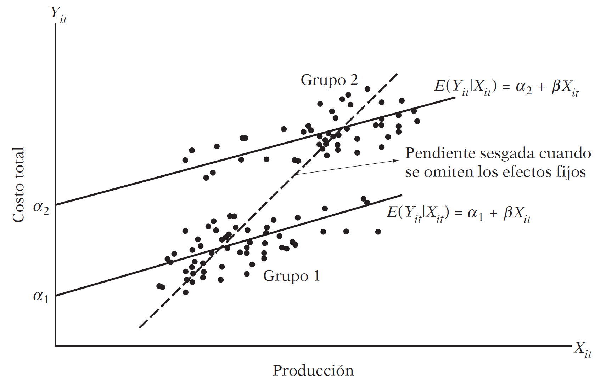
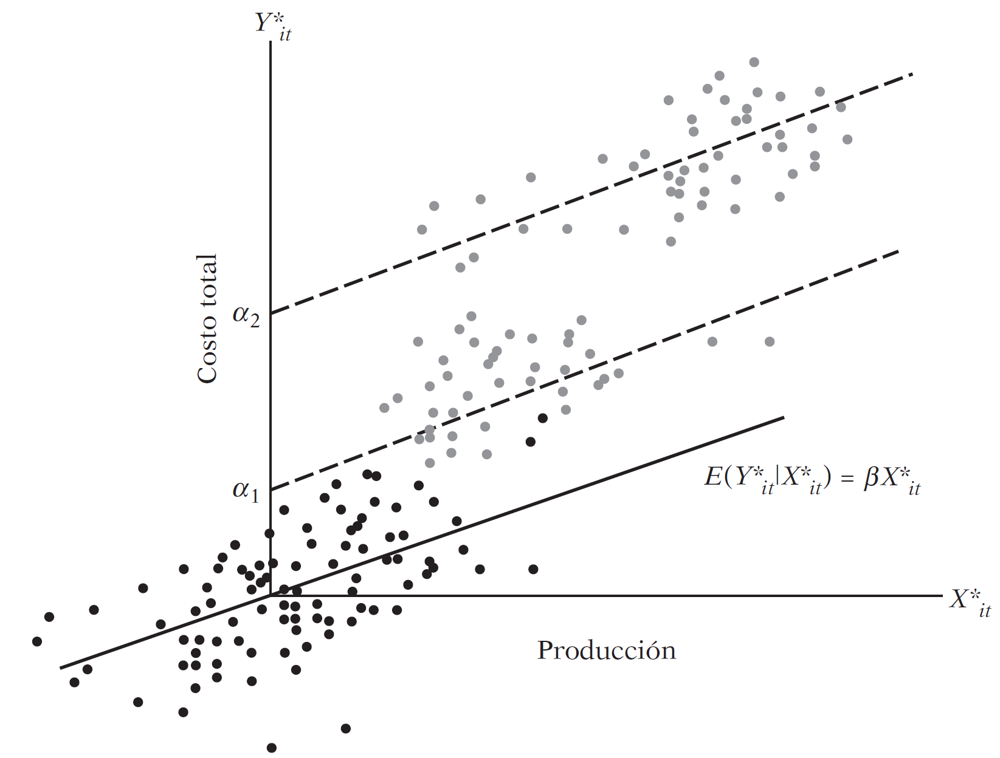

```{r setup, include = F}
# This is the recommended set up for flipbooks
# you might think about setting cache to TRUE as you gain practice --- building flipbooks from scratch can be time consuming
options(width = 70)
knitr::opts_chunk$set(
  dev.args = list(bg = 'transparent'),
  fig.width = 12, message = TRUE,
  warning = FALSE, comment = "", cache = TRUE, fig.retina = 3
)
knitr::opts_knit$set(global.par = TRUE)
Sys.setenv(`_R_S3_METHOD_REGISTRATION_NOTE_OVERWRITES_` = "false")
# remotes::install_github("luukvdmeer/sfnetworks")
# remotes::install_github("EvaMaeRey/flipbookr")
# remotes::install_github("rlesur/klippy")
# devtools::install_github("gadenbuie/xaringanExtra")
library(flipbookr)
library(xaringanthemer)
library(tidyverse)
library(klippy)
library(xaringanExtra)
```

<style>
.notbold{
    font-weight:normal
}

body {
text-align: justify;
}

h1{
      margin-top: -1px;
      margin-bottom: -3px;
}

.small-code pre{
  margin-bottom: -10px;
  
}  

.medium-code pre{
  margin-bottom: 2px;
  
} 
</style>

```{r xaringan-scribble, echo=FALSE}
xaringanExtra::use_scribble()
```

```{r xaringanExtra-clipboard, echo=FALSE}
htmltools::tagList(
  xaringanExtra::use_clipboard(
    button_text = "<i class=\"fa fa-clipboard\"></i>",
    success_text = "<i class=\"fa fa-check\" style=\"color: #90BE6D\"></i>",
    error_text = "<i class=\"fa fa-times-circle\" style=\"color: #F94144\"></i>"
  ),
  rmarkdown::html_dependency_font_awesome()
)
```

```{r xaringan-extra-styles, echo=FALSE}
xaringanExtra::use_extra_styles(
  hover_code_line = TRUE,         #<<
  mute_unhighlighted_code = TRUE  #<<
)
```
<font size = "5">

<br>
<br>
<br>
<br>
<br>

Link slides formato [html](https://gusgarciacruz.github.io/EconometriaII/ModelosPanel/ModelosPanel.html)

Link slides formato [PDF](https://gusgarciacruz.github.io/EconometriaII/ModelosPanel/ModelosPanel.pdf)
---
# <span style="font-size:80%">En este tema</span>

- <span style="font-size:140%">[<span style="color:black">Generalidades](#generalidades)</span>

- <span style="font-size:140%">[<span style="color:black">Tipos de paneles](#tipos)</span>

- <span style="font-size:140%">[<span style="color:black">Técnicas de estimación](#tecnicas)</span>

- <span style="font-size:140%">[<span style="color:black">Modelo de MCO agrupados (*Pooling*)](#pool)</span>

- <span style="font-size:140%">[<span style="color:black">Modelo efectos fijos: MCO con variable dicótoma (MCVD)](#ef)</span>

- <span style="font-size:140%">[<span style="color:black">Modelo efectos fijos: estimador intragrupal (*Within*)](#within)</span>

- <span style="font-size:140%">[<span style="color:black">Modelo de efectos aleatorios](#ea)</span>

- <span style="font-size:140%">[<span style="color:black">FE vs RE: algunos lineamientos](#lineamientos)</span>

- <span style="font-size:140%">[<span style="color:black">FE vs RE: qué dice Wooldridge](#wool)</span>

- <span style="font-size:140%">[<span style="color:black">Ejercicio aplicado en R: función de costos de líneas de aviación](#r)</span>

- <span style="font-size:140%">[<span style="color:black">El estimador de diferencia en diferencias](#did)</span>

---
# <span style="font-size:80%">Lecturas</span>
- <span style="font-size:150%">Wooldridge, J. (2013). *Introducción a la econometría. Un enfoque moderno*. 5a edición. Cenagage Learning <span style="color:blue">Cap. 13<br>

- <span style="font-size:150%">Gujarati, D. y Porter, D. (2010). *Econometría*. 5a edición, Mc Graw Hill. <span style="color:blue">Cap. 16<br>

---
name: generalidades
# <span style="font-size:80%">Generalidades</span>
<font size = "5">

<p style="margin-bottom: -.8em">

**¿Por qué datos panel? ¿Cuáles son las ventajas de los datos panel?**

- Como los datos de panel se refieren a individuos, empresas, estados, países, etc., a lo largo del tiempo, lo más seguro es la presencia de <span style="color:blue">heterogeneidad en las unidades</span>. Las técnicas de estimación de datos de panel toman en cuenta de manera explicita tal heterogeneidad, al permitir la existencia de variables específicas por sujeto

- Al combinar las series de tiempo de las observaciones de corte transversal, los datos de panel proporcionan <span style="color:blue">una mayor cantidad de datos informativos, más variabilidad, menos colinealidad entre variables, más grados de libertad y una mayor eficiencia</span>

---
# <span style="font-size:80%">Generalidades</span>
<font size = "5">

<p style="margin-bottom: -.8em">

**¿Por qué datos panel? ¿Cuáles son las ventajas de los datos panel?**

- Al estudiar las observaciones en unidades de corte transversal repetidas, <span style="color:blue">los datos de panel resultan más adecuados para estudiar la dinámica del cambio</span>. Los conjuntos de datos respecto del desempleo, la rotación en el trabajo y la movilidad laboral se estudian mejor con datos de panel

- <span style="color:blue">Los datos de panel detectan y miden mejor los efectos que sencillamente ni siquiera se observan en datos puramente de corte transversal o de series de tiempo</span>. Por ejemplo, los efectos de las leyes concernientes al salario mínimo sobre el empleo y los salarios, se estudian mejor si incluimos oleadas sucesivas de incrementos en los salarios mínimos estatales y/o federales

---
name: tipos
# <span style="font-size:80%">Tipos de paneles</span>
<font size = "5">

- <span style="color:blue">Panel balanceado</span>: se dice que un panel es balanceado si cada sujeto (empresa, individuos, etc.) tiene el mismo número de observaciones

- <span style="color:blue">Panel desbalanceado</span>: si cada unidad tiene un número diferentes de observaciones

- <span style="color:blue">Panel corto</span>: el número de unidades de corte transversal, $N$, es mayor que el número de períodos, $T$

- <span style="color:blue">Panel largo</span>: el número de unidades de corte transversal, $N$, es menor que el número de períodos, $T$

Las técnicas de estimación dependen de que se cuente con un panel corto o uno largo

---
name: tecnicas
# <span style="font-size:80%">Técnicas de estimación</span>
<font size = "5">

<p style="margin-bottom: -.8em">

Para ilustrar este tema asumamos que tenemos información sobre los costos de 6 líneas de aviación comercial  $(N=6)$ de 1970 a 1984 $(T=15)$, para un total de 90 observaciones de datos panel. Con esto en mente, las técnicas de estimación son las siguientes: 

<p style="margin-bottom: -.6em">

- <span style="color:blue">Modelo de MCO agrupados (*Pooling*)</span><br>
Se agrupan las 90 observaciones y se estima una sola regresión, sin tener en cuenta ni la parte de corte transversal ni la parte de series de tiempo

<p style="margin-bottom: -.6em">

- <span style="color:blue">Modelo efectos fijos: MCO con variables dicótomas (MCVD)</span><br>
Aquí se agrupan las 90 observaciones, pero se permite que cada unidad de corte transversal (cada aerolínea) tenga su propia variable dicótoma (intercepto)

<p style="margin-bottom: -.6em">

- <span style="color:blue">Modelo efectos fijos: estimador intragrupal (*Within*)</span><br>
En este caso también se agrupan las 90 observaciones, pero por cada aerolínea expresamos cada variable como una desviación de su valor medio y luego estimamos una regresión de MCO sobre los valores corregidos por la media

<p style="margin-bottom: -.6em">

- <span style="color:blue">Modelo de efectos aleatorios</span><br>
A diferencia del modelo MCVD, en el que se permite que cada aerolínea tenga su propio valor de intercepto (fijo), suponemos que los valores del intercepto son una extracción aleatoria de una población mucho mayor de aerolíneas

---
name: pool
# <span style="font-size:80%">Modelo de MCO agrupados (*Pooling*)</span>
<font size = "5">

<p style="margin-bottom: -.6em">

Considere el siguiente modelo a estimar, el cual representa una función de costos:

<p style="margin-bottom: -.5em">

$$C_{it} = \beta_{1} + \beta_{2}Q_{it} + \beta_{3}PF_{it} + \beta_{4}LF_{it} + u_{it}$$
<span style="font-size:80%"> $C$: costos totales (en miles de dólares); $Q$: producción (ingresos por milla por pasajero); $PF$: precio del combustible; $LF$: factor de carga (la utilización promedio de la capacidad de la flotilla)</span>

<p style="margin-bottom: -.4em">

En este modelo:

<p style="margin-bottom: -.6em">

- Se supone que los coeficientes de regresión son iguales para todas las aerolínas $\Longrightarrow$ no hay distinción entre aerolíneas: una aerolínea es tan buena como la otra

<p style="margin-bottom: -.6em">

- No distingue entre las diferentes aerolíneas ni indica si la respuesta del costo total a las variables explicativas a través del tiempo es la misma para todas las aerolíneas $\Longrightarrow$ <span style="color:blue">si agrupamos diferentes aerolíneas en diferentes períodos se oculta la heterogeneidad (individualidad o singularidad) que existen entre las unidades</span>

<p style="margin-bottom: -.6em">

- La heterogeneidad individual se subsume en $u_{it}$, con lo cual el término de error se correlacionará con algunos regresores, en este caso <span style="color:blue">los coeficientes estimados pueden estar sesgados y ser inconsistentes</span>

---
# <span style="font-size:80%">Modelo de MCO agrupados (*Pooling*)</span>
<font size = "5">

<p style="margin-bottom: -.6em">

Miremos cómo el término de error se correlaciona con los regresores. Considere el siguiente modelo:

$$C_{it} = \beta_{1} + \beta_{2}Q_{it} + \beta_{3}PF_{it} + \beta_{4}LF_{it} + \beta_{5}M_{i} + u_{it}$$
<p style="margin-bottom: -.6em">

donde $M$ es la filosofía de la administración o calidad de la administración

Dos cosas sobre esta nueva variable
<p style="margin-bottom: -.8em">
- es invariante o constante en el tiempo
- no puede observarse directamente

Una forma indirecta de medir el efecto de $M$ es a partir del siguiente cambio en el modelo

$$C_{it} = \beta_{1} + \beta_{2}Q_{it} + \beta_{3}PF_{it} + \beta_{4}LF_{it} + \alpha_{i} + u_{it}$$
donde $\alpha_{i}$ representa el <span style="color:blue">efecto no observado o de heterogeneidad no observable</span>

<p style="margin-bottom: -.6em">

Esta heterogeneidad no observable puede estar asociada a otras variables, como por ejemplo el grado de habilidad del gerente, si el gerente es hombre o mujer, etc.

---
# <span style="font-size:80%">Modelo de MCO agrupados (*Pooling*)</span>
<font size = "5">

<p style="margin-bottom: -.6em">

Una pregunta que puede surgir es si el término $\alpha_{i}$ no es observable, ¿por qué no considerarlo aleatorio e incluirlo en el término de error $u_{it}$? Entonces el modelo queda de la forma

$$C_{it} = \beta_{1} + \beta_{2}Q_{it} + \beta_{3}PF_{it} + \beta_{4}LF_{it} + v_{it}$$

<p style="margin-bottom: -.6em">
donde $v_{it} = \alpha_{i} + u_{it}$

Si $\alpha_{i}$ esta correlacionado con cualquiera de los regresesores del modelo, entonces $v_{it}$ estará correlacionado con los regresores y estaría violando el supuesto de exogeneidad. Esto implica que los estimadores por MCO son sesgados e inconsistentes

La pregunta entonces es

<p style="margin-bottom: -.6em">

<center>
<span style="color:blue">¿Cómo se toman en cuenta los efectos no observables o heterogeneidad no observable, para obtener estimaciones consistentes y eficientes de las variables de interés primordial?</span>
</center>

<p style="margin-bottom: -.4em">

Se debe tener en cuenta que el interés primordial no se centra en obtener el efecto de la heterogeneidad no observable, ya que esta no cambia para una unidad dada. Por esta razón, la heterogeneidad no observable se llaman <span style="color:blue">parámetros incómodos</span> ¿Cómo proceder entonces?

---
name: ef
# <span style="font-size:80%">Modelo efectos fijos: MCO con variables dicótomas (MCVD)</span>
<font size = "5">

El MCVD toma en cuenta la heterogeneidad entre las unidades analizadas ya que permite que cada unidad tenga su propio valor del intercepto. El modelo queda de la forma

$$C_{it} = \beta_{1i} + \beta_{2}Q_{it} + \beta_{3}PF_{it} + \beta_{4}LF_{it} + u_{it}$$
Las diferencias entre unidades quizá se deban características especiales de cada aerolínea, como el estilo de administración, la filosofía de la empresa o el tipo de mercado que atiende cada aerolínea

El término de efectos fijos se debe a que, aunque el intercepto puede diferir entre las unidades, el intercepto de cada una de éstas no varía con el tiempo, es decir, es <span style="color:blue">invariante en el tiempo</span>

---
# <span style="font-size:80%">Modelo efectos fijos: MCO con variable dicótoma (MCVD)</span>
<font size = "5">

Comparando el modelo *Pooling* con el MCVD, visualmente sería

```{r echo=FALSE, out.width="600px", fig.align='center'}

```

<center>
<span style="color:blue">La regresión agrupada sesga la estimación de la pendiente</span>
</center>

---
# <span style="font-size:80%">Modelo efectos fijos: MCO con variable dicótoma (MCVD)</span>
<font size = "5">

¿Cómo se permite en realidad que el intercepto (de efecto fijo) varíe entre unidades?

Se realiza con la técnica de variables dicótomas, en particular las <span style="color:blue">variables dicótomas con intercepto diferencial</span>. El modelo queda de la forma

$$C_{it} = \alpha_{1} + \alpha_{2}D_{2i} + \alpha_{3}D_{3i} + \alpha_{4}D_{4i} + \alpha_{5}D_{5i} + \alpha_{6}D_{6i} + \beta_{2}Q_{it} + \beta_{3}PF_{it} + \beta_{4}LF_{it} + u_{it}$$
$D_{2i} = 1$ si corresponde a la aerolínea 2, y 0 en otro caso; y así para las otras dummies

Si los coeficientes de los interceptos diferenciales son estadísticamente significativos, indicaría que las seis aerolíneas son heterogéneas 

---
# <span style="font-size:80%">Modelo efectos fijos: MCO con variable dicótoma (MCVD)</span>
<font size = "5">

Es posible proporcionar una prueba para comparar el modelo *Pooling* y el de efectos fijos. Note que el modelo *Pooling* es un modelo restringido, pues se impone un intercepto común para todas las aerolíneas. Se puede utilizar la prueba $F$ restringida

$$F = \frac{(R_{NR}^2-R_{R}^2)/m}{(1-R_{NR}^2)/(n-k)}$$

$m$: número de restricciones lineales<br>
$k$: número de parámetros en la regresión no restringida<br>
$n$: número de observaciones<br>
$R_{NR}^2$ y $R_{R}^2$: $R^2$ obtenidos de la regresión no restringida y restringida, respectivamente

La $H_{0}$ en este caso es que todos los interceptos diferenciales son iguales a cero. Si se rechaza $H_{0}$ indica que el modelo de efectos fijos es mejor que el modelo *Pooling*

---
name: within
# <span style="font-size:80%">Modelo efectos fijos: estimador intragrupal (*Within*)</span>
<font size = "5">

Una forma de estimar una regresión agrupada es eliminar el efecto fijo, $\beta_{1i}$, expresando los valores de las variables dependiente y explicativas de cada unidad como desviaciones de sus respectivos valores medios en el tiempo. 

Si para cada $i$ se promedia la ecuación en el tiempo se obtiene

$$\bar{C}_{i} = \beta_{1i} + \beta_{2}\bar{Q}_{i} + \beta_{3}\bar{PF}_{i} + \beta_{4}\bar{LF}_{i} + \bar{u}_{i}$$
donde $\bar{C}_{i} = \frac{\sum C_{it}}{T}$, y así sucesivamente. Si se resta la ecuación original con la anterior, se tiene

$$C_{it} - \bar{C}_{i} = \beta_{2}(Q_{it}-\bar{Q}_{i}) + \beta_{3}(PF_{it}-\bar{PF}_{i}) + \beta_{4}(LF_{it}-\bar{LF}_{i} + (u_{it}-\bar{u}_{i})$$
$$\ddot{C}_{it} = \beta_{2}\ddot{Q}_{it} + \beta_{3}\ddot{PF}_{it} + \beta_{4}\ddot{LF}_{it} + \ddot{u}_{it}$$

Se nota que el efecto inobservable, $\beta_{1i}$, ha desaparecido 

---
# <span style="font-size:80%">Modelo efectos fijos: estimador intragrupal (*Within*)</span>
<font size = "5">

Gráficamente el estimador *Within* sería

```{r echo=FALSE, out.width="600px", fig.align='center'}

```

---
# <span style="font-size:80%">Modelo efectos fijos: estimador intragrupal (*Within*)</span>
<font size = "5">

- El estimador Within produce estimaciones consistentes de los coeficientes de pendiente, mientras que la regresión agrupada tal vez no

- Sin embargo, debe añadirse que los estimadores *Within*, aunque consistentes, son ineficientes (es decir, tienen varianzas grandes) en comparación a los *Pooling*

- Los estimadores *Within* arrojan estimaciones de las pendientes iguales a las estimaciones del MCVD, esto es porque matemáticamente los dos modelos son idénticos

- Una desventaja del modelo *Within* es que las variables invariantes en el tiempo se elimiarían del modelo, con lo cual no se sabría el efecto de la variable dependiente ante cambios en esas variables independientes invariantes en el tiempo. Pero es el precio que hay que pagar para evitar la correlación entre el término de error ( $\alpha_{i}$ incluido en $v_{it}$) las variables explicativas

- Otra desventaja es que puede distorsionar los valores de los parámetros y desde luego eliminar los efectos de largo plazo

---
name: ea
# <span style="font-size:80%">Modelo de efectos aleatorios</span>
<font size = "5">

- Cuando se utilizan efectos fijos, el objetivo es eliminar $\beta_{1i}$ porque se considera que está correlacionada con una o más de las $X_{itj}$

- Pero suponga que $\beta_{1i}$ no está correlacionada con ninguna variable explicativa en todos los períodos. Entonces, el uso de una transformación para eliminar $\beta_{1i}$ da como resultado estimadores ineficientes

- <span style="color:blue">El modelo se vuelve el modelo de efectos aleatorios cuando se da por sentado que el efecto inobservable $\beta_{1i}$ no se correlaciona con ninguna variable explicativa</span> 

---
# <span style="font-size:80%">Modelo de efectos aleatorios</span>
<font size = "5">

<p style="margin-bottom: -.8em">

La idea básica es comenzar con la ecuación

<p style="margin-bottom: -.5em">

$$C_{it} = \beta_{1i} + \beta_{2}Q_{it} + \beta_{3}PF_{it} + \beta_{4}LF_{it} + u_{it}$$
<p style="margin-bottom: -.5em">

En lugar de considerar fija a $\beta_{1i}$, suponemos que es una variable aleatoria con un valor medio igual a $\beta_{1}$. Además, el valor del intercepto para una empresa individual se expresa como:

<p style="margin-bottom: -.5em">

$$\beta_{1i} = \beta_{1} + \epsilon_{i}$$
<p style="margin-bottom: -.5em">

donde $\epsilon_{i}$ es un termino de error aleatorio con valor medio igual a cero y varianza $\sigma_{\epsilon}^2$

<p style="margin-bottom: -.5em">

<span style="color:blue">Lo que se afirma es que las seis empresas de la muestra se tomaron de un universo mucho más grande de este tipo de compañías, que tienen una media común para el intercepto ( $=\beta_{1}$) y que las diferencias individuales en los valores del intercepto de cada empresa se reflejan en el término de error $\epsilon_{i}$</span>

<p style="margin-bottom: -.5em">

Bajo el anterior supuesto el modelo queda de la forma

$$
\begin{aligned}
C_{it} = & \beta_{1} + \beta_{2}Q_{it} + \beta_{3}PF_{it} + \beta_{4}LF_{it} + \epsilon_{i} + u_{it}\\
											 = & \beta_{1} + \beta_{2}Q_{it} + \beta_{3}PF_{it} + \beta_{4}LF_{it} +  w_{it}
\end{aligned}
$$


donde $w_{it} = \epsilon_{i} + u_{it}$

---
# <span style="font-size:80%">Modelo de efectos aleatorios</span>
<font size = "5">

$$w_{it} = \epsilon_{i} + u_{it}$$
$w_{it}$ presenta dos componentes
<p style="margin-bottom: -.8em">
- $\epsilon_{i}$: componente de error de corte transversal o error específico del individuo
<p style="margin-bottom: -.8em">
- $u_{it}$: la combinación del componente de error de series de tiempo y corte transversal, y que a veces se denomina <span style="color:blue">término idiosincrásico</span>

Por estos dos componentes del término de error es que el modelo de efectos aleatorios también se llama <span style="color:blue">Modelo de Componentes del Error (MCE)</span>

Los supuestos comunes en los que se basa el MCE son:
<p style="margin-bottom: -.8em">
- $\epsilon_{i}\sim N(0,\sigma_{\epsilon}^2)$
- $u_{it}\sim N(0,\sigma_{u}^2)$
- $E(\epsilon_{i}u_{it})=0$; $E(\epsilon_{i}\epsilon_{j})= 0, i\neq j$
- $E(u_{it}u_{is})=E(u_{ij}u_{ij})=E(u_{it}u_{js})=0, i\neq j; t\neq s$

---
# <span style="font-size:80%">Modelo de efectos aleatorios</span>
<font size = "4">

Diferencias entre el modelo de efectos fijo y el modelo de efectos aleatorios

<span style="color:blue">En el modelo de efectos fijos, cada unidad de corte transversa tiene su propio valor (fijo) de intercepto. En el modelo de efectos aleatorios, el intercepto (común) representa el valor medio de todos los interceptos de (de corte transversal), y el componente de error $\epsilon_{i}$ significa la desviación (aleatoria) de intercepto individual respecto al valor medio</span>

Como resultado de los supuestos establecidos, se deriva que


$$E(w_{it}) = 0$$


$$Var(w_{it}) = \sigma_{\epsilon}^2 + \sigma_{u}^2$$

Si $\sigma_{\epsilon}^2 = 0$ no hay diferencias entre el modelo *Pooling* y el modelo de efectos aleatorios, en cuyo caso se hará la regresión *Pooling*

Aunque $w_{it}$ sea homocedástico puede demostrarse que $w_{it}$ y $w_{is}$ están correlacionados, se tiene entonces que

$$\rho = Corr(w_{it},w_{is}) = \frac{\sigma_{\epsilon}^2}{\sigma_{\epsilon}^2 + \sigma_{u}^2}; t\neq s$$
Si no tenemos en cuenta esta estructura de correlación y estimamos el modelo de efectos aleatorios mediante MCO, los estimadores resultantes serán ineficientes. El método más adecuado en este caso es el de <span style="color:blue">Mínimos Cuadrados Generalizados (MCG)</span>

---
# <span style="font-size:80%">Modelo de efectos aleatorios</span>
<font size = "5">

<p style="margin-bottom: -.8em">

La pregunta que surge ahora es cuál modelo estimar, el modelo de efectos fijos o el modelo de efectos aleatorios?

<span style="text-decoration:underline">**<span style="color:blue">Test de Hausman</span>**</span>

<p style="margin-bottom: -.8em">

- En este test $H_{0}$ es que los estimadores del modelo de efectos fijos y el modelo de efectos aleatorios no difieren considerablemente
- El estadístico de prueba tiene una distribución asintótica $\chi^2$
- Si se rechaza $H_{0}$, la conclusión es que el modelo de efectos aleatorios no es apropiado, ya que es probable que los efectos aleatorios estén correlacionados con una o más regresores. En este caso el modelo de efectos fijos se prefiere al modelo de efectos aleatorios

<span style="text-decoration:underline">**<span style="color:blue">Test LM de Breusch-Pagan</span>**</span>
 
<p style="margin-bottom: -.8em">
 
- En este test $H_{0}$ es que no hay efectos aleatorios, es decir, que $\sigma_{\epsilon}^2$ en $Var(w_{it}) = \sigma_{\epsilon}^2 + \sigma_{u}^2$ es cero 
- El estadístico de prueba tiene una distribución asintótica $\chi^2$ con 1 gdl, sólo 1 gdl ya que se esta probando una sola hipótesis
- Si no rechazamos la $H_{0}$ implica que el modelo de efectos aleatorios no es apropiado

---
name: lineamientos
# <span style="font-size:80%">FE vs RE: algunos lineamientos</span>
<font size = "5">

- La disyuntiva que enfrenta un investigador es: ¿qué modelo es mejor, modelo de efectos fijos o modelo de efectos aleatorios? La respuesta
gira en torno del supuesto respecto de la probable correlación entre el componente de error individual, o específico de la unidad de corte transversal, $\epsilon_{i}$, y las regresoras $X$

- Si se supone que $\epsilon_{i}$ y las $X$ no están correlacionados, el modelo de efectos aleatorios puede resultar apropiado; pero
si $\epsilon_{i}$ y las $X$ están correlacionados, entonces el modelo de efectos fijos puede ser adecuado

- El supuesto en que se basa el modelo de efectos aleatorios es que $\epsilon_{i}$ representa una muestra aleatoria de una población mucho más grande, aunque no siempre es así

- Si $T$ es grande y $N$ es pequeño, es probable que haya muy poca diferencia entre los valores de los parámetros estimados mediante el modelo de efectos fijos y el modelo de efectos aleatorios. Por tanto, en este caso la elección se basa en la conveniencia de cálculo. Desde esta perspectiva, parece preferible el modelo de efectos fijos

---
name: woo
# <span style="font-size:80%">FE vs RE: qué dice Wooldridge</span>
<font size = "5">

```{r echo=FALSE, out.width="550px", fig.align='center'}

```

[Link al tweet](https://twitter.com/jmwooldridge/status/1365746478183047172)

---
name: r
# <span style="font-size:80%">Ejercicio aplicado en R: función de costos de líneas de aviación</span>
<font size = "5">

En este ejercicio aplicado se va a estudiar la función de costos de 6 líneas de aviación comercial entre 1970 y 1984, para un total de 90 observaciones de datos de panel. La ecuación a estimar es la siguiente:

$$C_{it} = \beta_{1i} + \beta_{2}Q_{it} + \beta_{3}PF_{it} + \beta_{4}LF_{it} + u_{it}$$
<span style="font-size:70%">
$i$: identificación de la aerolínea; $t=1970...1984$; $C$: costo total, en 1000 dólares; $Q$: producción, como ingresos por milla por pasajero (es un índice); $PF$: precio del combustible; $LF$: factor de carga, la utilización promedio de la capacidad de la flotilla</span>

<p style="margin-bottom: -.8em">
En los siguientes links se encuentran los datos y el código utilizado en R:
- [Datos](https://gusgarciacruz.github.io/EconometriaII/ModelosPanel/Table 16.1 Gujarati.dta)
- [Código en R](https://gusgarciacruz.github.io/EconometriaII/ModelosPanel/Tema 12.R)

---
name: did
# <span style="font-size:80%">El estimador de diferencia en diferencias</span>
<font size = "4">

- Una importante ventaja de tener datos panel es que permite evaluar el impacto de ciertos eventos y políticas

- Con información antes y después de la ocurrencia del evento, la intervención o la política, es posible determinar el efecto sobre variables económicas

- Cuando los datos surgen de un **experimento natural** (o de un **cuasiexperimento**) y se tiene información antes y después del evento, es posible identificar efectos causales de dicho evento sobre variables económicas

- **Experimento natural**: tiene lugar cuando algún evento exógeno (es decir, que el evento ocurre de manera natural, sin manipulación del investigador), a menudo un cambio en las políticas gubernamentales, modifica el amniente en el que se desenvuelven las personas, las familias, las empresas o las ciudades

- **Cuasiexperimento**: es un experimento que intenta imitar un experimento real, pero no puede asignar aleatoriamente a los participantes

- **Efectos causales**: se refieren al impacto que una variable tiene sobre otra, donde una variable es la causa y la otra es el efecto. Esto es diferente de la correlación, donde dos variables pueden moverse juntas sin que una cause la otra. Identificar los efectos causales es fundamental para comprender la relación entre eventos, tomar decisiones informadas y diseñar intervenciones efectivas

---
# <span style="font-size:80%">El estimador de diferencia en diferencias</span>
<font size = "5">

- En un experimento natural siempre se cuenta con un **grupo de control** y un **grupo de tratamiento**:
<p style="margin-bottom: -.8em">
  - **Grupo de control**: grupo que no se ve afectado por el cambio de política
  - **Grupo de tratamiento**: grupo que se ve afetado por el cambio de política

- A diferencia de un experimento verdaderos (asignación aleatoria o RCT (Randomized Controlled Trial) que significa Ensayo Aleatorio Controlado), en el cual los grupos de control y de tratamiento se eligen de manera aleatoria y explícita, en los experimentos naturales los grupos surgen a partir del cambio en una política particular

- Para controlar las diferencias sistemáticas entre los dos grupos, se necesitan datos de (al menos) dos años, un año antes y otro después del cambio de la politica

- Así, la muestra se descompone en cuatro grupos:
<p style="margin-bottom: -.8em">
  - Grupo de control antes del cambio
  - Grupo de control después del cambio
  - Grupo de tratamiento antes del cambio
  - Grupo de tratamiento después del cambio

---
# <span style="font-size:80%">El estimador de diferencia en diferencias</span> 
<font size = "4">
Sea:
<p style="margin-bottom: -.8em">
  - $C$ el grupo de control y $T$ el grupo de tratamiento
  - $dT$ es igual a 1 para los miembros del grupo de tratamiento $T$ e igual a 0 si no lo son
  - $d2$ es igual a 1 para el segundo periodo (después del cambio de la política) y 0 en el primer periodo (antes del cambio de la política)
  
La ecuación que interesa estimar es:
<p style="margin-bottom: -.8em">
$$y = \beta_0 + \delta_0d2 + \beta_1dT + \delta_1d2\cdot dT + u$$
$\delta_1$ mide el efecto causal la política. Sin otros factores en la regresión, $\hat{\delta}_1$ será el estimador de diferencia en diferencias:

$$\hat{\delta}_1=(\bar{y}_{2,T}-\bar{y}_{2,C})-(\bar{y}_{1,T}-\bar{y}_{1,C})$$
donde la barra indica el promedio, el primer subíndice denota el año y el segundo subíndice, el grupo

<p style="margin-bottom: 2em">

$\delta_1$ en la literatura también es llamado el **efecto promedio del tratamiento** (ATE: Average Treatment Effects), debido a que mide el efecto del "tratamiento" o la política sobre el resultado promedio de $y$ 

Cuando se añaden variables explicativas, para controlar el hecho de que las poblaciones muestrales pueden diferir sistemáticamente a lo largo de dos periodos, la estimación por MCO de $\delta_1$ ya no tiene la forma simple de la última ecuación, pero su interpretación es similar